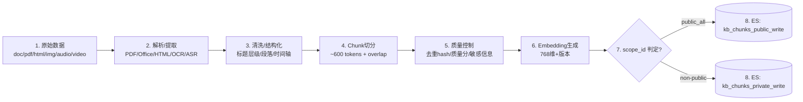
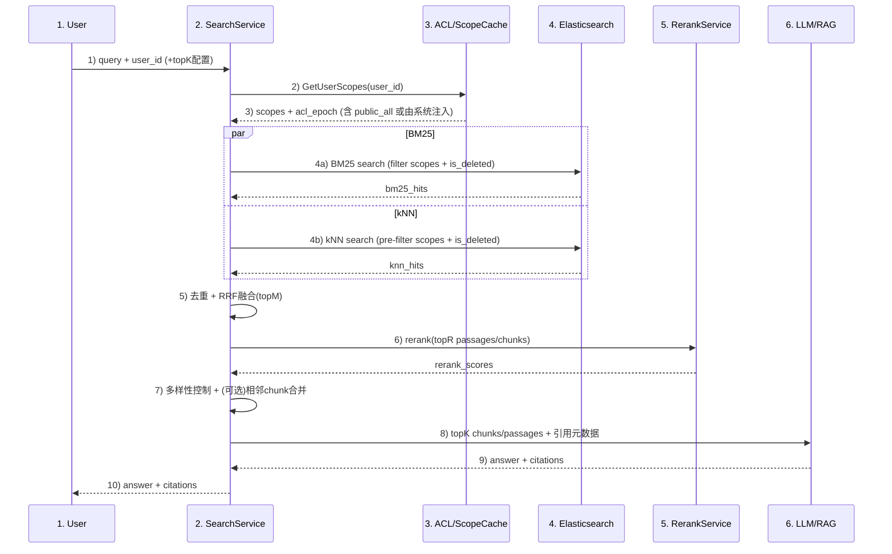
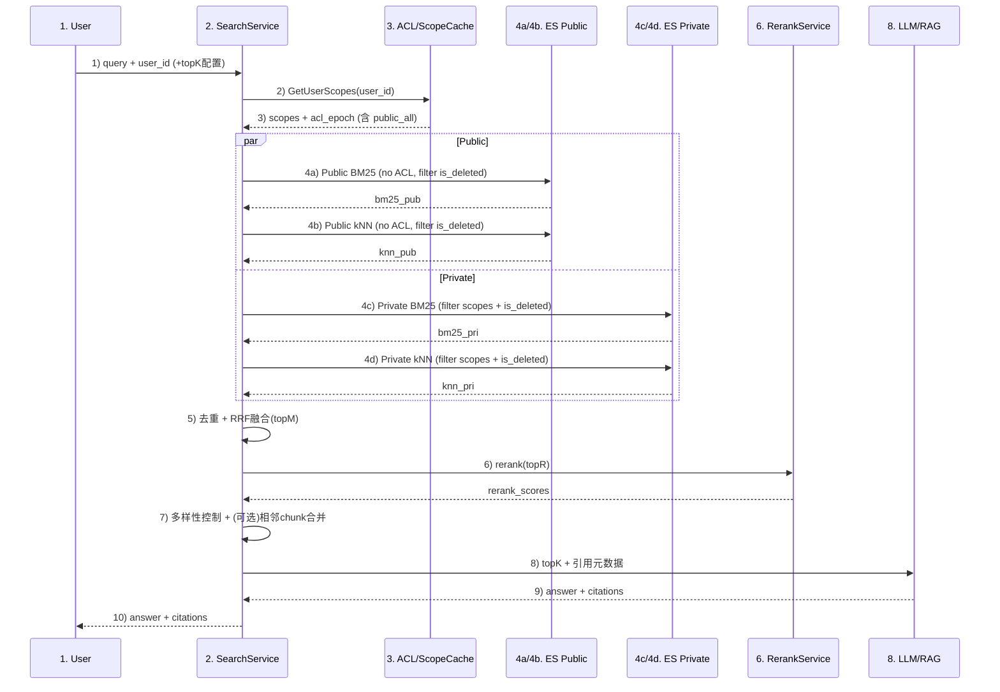
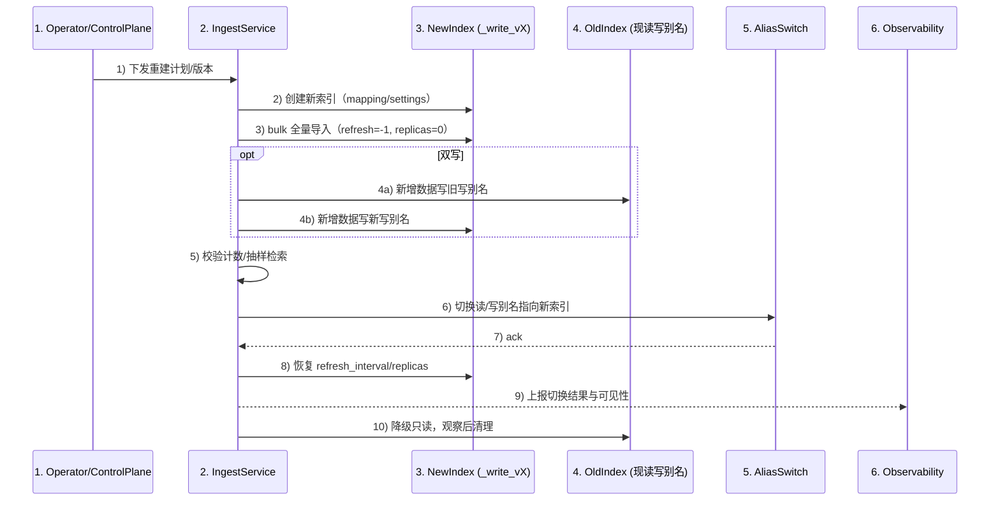
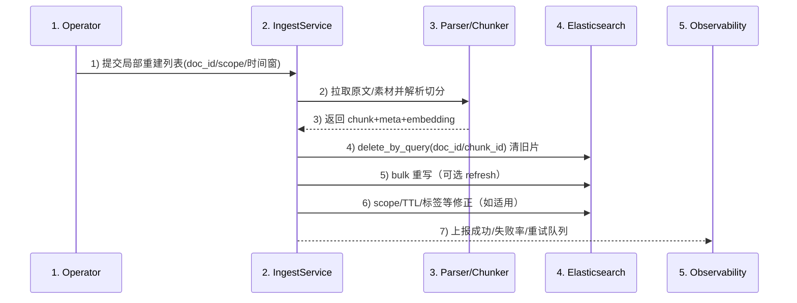

# 容翼查索引与检索详细设计方案

- 文档版本：v0.2.1（修订版）
- 当前日期：2025-12-17

---

## 1. 概述

容翼查面向企业内部知识库系统的多类型 KB（Enterprise/Department/Personal/Agent）进行索引构建与检索服务。多模态内容（图片/音频/视频）统一转为文本后入库。检索以 RAG 为主要应用场景，提供高效召回与高准确性排序，并对权限做强约束，保障越权召回率为 0。

> 已知或假设约束/现状：  
> - 启动阶段 chunk 规模：约 **100 万**；目标阶段：约 **1000 万**  
> - **70% chunk 为严格全员可见**（定义为 `public_all`，永远无需 ACL）  
> - 查询模式：**全局在用户可见范围内搜索**（不指定 kb_id）  
> - embedding：**768 维**  
> - chunk 平均：约 **600 tokens**（400~800，overlap 80~120）  
> - Hybrid 检索占比：**约 95%**（BM25 + kNN）  
> - 需要 **rerank**，必要时再叠加 LLM rerank（默认关闭）

---

## 2. 目标

- 支持 **关键词检索（BM25）+ 语义向量检索（kNN/HNSW）+ Hybrid 融合 + Rerank**
- 文档、图片、音频/视频等多模态内容统一对齐为文本语义
- 权限只与 `user_id` 关联，**越权召回率必须为 0**
- 可从 100 万 chunk 平滑演进至 1000 万 chunk
- 支持索引重建（影子索引 + 别名切换）与局部重建

---

## 3. 总体架构

### 3.1 设计要点

1. **权限采用 scope_id 抽象**：chunk 归属唯一 scope_id；检索时 scope filter 做强约束  
2. **最小可行版本（MVP）阶段先单索引**（~100 万 chunk）快速上线：统一 `scope_id` 过滤  
3. **规模化（Scale）阶段（千万级）拆 public/private**：  
   - public 索引仅包含 `scope_id=public_all`，**不做 ACL filter**  
   - private 索引包含所有非 `public_all` 的 scope，**强制 ACL pre-filter**  
4. **Hybrid 95% + rerank 必选**：召回窗口适中，rerank 提升精度  
5. 多模态统一：OCR/ASR/字幕/关键帧描述 → 文本 → chunk → embedding  
6. **语义增强（全文档级 + 切片级）**：摘要/关键词/问题/标签等结构化信号入库，用于排序与可解释性  
7. **一致性与越权=0**：ACL 缓存引入版本号（epoch），权限收回不允许 TTL 窗口越权

### 3.2 组件与职责

- **IngestService**：解析、清洗、切分、embedding、写入 ES
- **ACLService**：`GetUserScopes(user_id) -> scopes + acl_epoch`
- **ScopeCache**：Redis + 本地 LRU（带 epoch 校验）
- **SearchService**：BM25/kNN 并行召回、融合、rerank、多样性控制、上下文构建
- **RerankService**：cross-encoder rerank；可选 LLM rerank
- **Elasticsearch**：倒排索引 + HNSW 向量索引

---

## 4. 权限模型

### 4.1 设计原则

- 权限只与 `user_id` 关联，但检索需高性能：将授权集合抽象为有限的 `scope_id`
- 每个 chunk **必须且只能**归属一个 `scope_id`
- `public_all` 定义为**严格全员可见**：任何用户无需 ACL 即可访问

### 4.2 scope_id 约定

- `public_all`：全员可见（约 70% chunk）
- 其他：部门/项目/共享/个人/agent 等，均映射为 scope_id，例如：  
  - `dept_finance`、`project_abc`、`kb_shared_xxx`、`user_12345`、`agent_987`

> 约束：只有“严格全员可见”才允许进入 public 索引；任何“部分公开/范围公开”都必须进入 private 并走 ACL filter。

### 4.3 ACL 数据与缓存

- ACL 服务：`GetUserScopes(user_id) -> { scopes: [scope_id...], acl_epoch: long }`
- `public_all` 由系统默认注入（无需在 ACL 中为所有用户存储）
- 缓存：Redis + 本地 LRU  
  - TTL：1~5 分钟（降低 QPS）
  - 权限变更：事件驱动主动失效（优先）
  - **强一致保障**：每次检索请求必须使用最新 `acl_epoch`；缓存命中但 epoch 不匹配则强制刷新

### 4.4 越权=0 的保证

要实现“越权=0”，必须同时满足：

1. **索引层过滤**：任何涉及 private 内容的 ES 查询必须带 `terms scope_id in user_scopes`（filter context）  
2. **ACL 强一致**：权限收回时必须更新 `acl_epoch`；SearchService 发现 epoch 变化必须重新拉 scopes，禁止使用旧 scopes  
3. **服务端二次校验（兜底）**：对返回结果的 `scope_id` 做集合包含校验  
4. **写入侧正确性**：scope_id 判定逻辑需可审计；禁止把私有内容写成 public_all

---

## 5. 索引设计

### 5.1 单索引（MVP）

- 索引：`kb_chunks_v1`
- public/private 混存，通过 `scope_id` 区分
- 所有查询统一 `terms scope_id in user_scopes`

**优点**：快速上线、运维简单  
**缺点**：到千万级时，public 也走 ACL filter 会浪费资源（Scale 解决）

### 5.2 public/private 双索引（Scale）

- `kb_chunks_public_v1`：仅 `scope_id=public_all`  
- `kb_chunks_private_v1`：`scope_id!=public_all`

检索四路并行：  
- public BM25 + public kNN（无 ACL filter）  
- private BM25 + private kNN（强制 ACL filter）  
融合 + rerank 后统一返回

### 5.3 private 分业务库

- 按业务/部门/租户拆分私有索引：  
  - `kb_chunks_private_finance_v1`、`kb_chunks_private_hr_v1`、`kb_chunks_private_it_v1`
- 检索路由：
  - 公共索引：仍走 public BM25/kNN（无 ACL）
  - 私有索引：依据用户 scopes 推导所属业务索引集合，仅查询相关私有索引；并仍带 scope filter
- 优点：降低 shard fanout、便于业务级扩缩容与演进
- 成本/注意：索引数量上升；写入需按业务路由；监控与容量规划按业务索引粒度进行

---

## 6. 索引构建（Ingestion）流程

### 6.1 文本类

- 解析：PDF/Office/HTML/Markdown/TXT/邮件/工单/IM 等
- 清洗：去噪、去模板、保留标题层级与结构
- chunk：平均 600 tokens，overlap 80~120（范围：400~800 tokens）
- 生成 embedding：768 维，写入 `embedding_model/embedding_version`

### 6.2 多模态统一转文本

- 图片：OCR → 文本 → chunk → embedding
- 音频：ASR → transcript → chunk（时间段 + token 上限）→ embedding
- 视频：字幕/ASR + 关键帧描述 → transcript → chunk（章节/时间段）→ embedding
- 保留媒体定位字段：`start_ms/end_ms`
- 建议将置信度写入 `chunk_meta`：如 `ocr_confidence`、`asr_confidence`

### 6.3 质量与幂等

- 去重：`content_hash`（SHA1/xxhash）  
- 质量分：`quality_score`
- 幂等写入：`_id = chunk_id`
- chunk_id 版本化策略：见第 14.2 节

---

## 7. Mapping 模板（JSON 示例）

> 说明：  
> - `dynamic: strict`：保证字段写入严格可控  
> - 增加 `is_deleted/deleted_at/expires_at` 支撑删除与留存  
> - MVP 使用单向量 `embedding`；多向量可在 v2 扩展
> - 该模板通过 index template 复用到 `kb_chunks_public_*` / `kb_chunks_private_*` / 业务私有索引及 `_write_vX` 影子索引（读写别名指向对应索引）

```json
PUT kb_chunks_v1
{
  "settings": {
    "number_of_shards": 3,
    "number_of_replicas": 1,
    "refresh_interval": "10s",
    "analysis": {
      "analyzer": {
        "zh_smart": { "type": "ik_smart" },
        "zh_max": { "type": "ik_max_word" },
        "en_std": { "type": "standard" },
        "pinyin_analyzer": {
          "tokenizer": "standard",
          "filter": ["lowercase", "my_pinyin"]
        }
      },
      "filter": {
        "my_pinyin": {
          "type": "pinyin",
          "keep_full_pinyin": true,
          "keep_first_letter": true,
          "keep_separate_first_letter": false,
          "keep_joined_full_pinyin": true,
          "keep_original": true,
          "limit_first_letter_length": 16,
          "remove_duplicated_term": true
        }
      }
    }
  },
  "mappings": {
    "dynamic": "strict",
    "dynamic_templates": [
      {
        "strings_as_keyword": {
          "match_mapping_type": "string",
          "mapping": { "type": "keyword", "ignore_above": 512 }
        }
      }
    ],
    "properties": {
      "scope_id": { "type": "keyword" },
      "doc_id": { "type": "keyword" },
      "doc_version": { "type": "integer" },
      "chunk_id": { "type": "keyword" },
      "chunk_index": { "type": "integer" },

      "primary_id":   { "type": "keyword" },
      "knowledge_id": { "type": "keyword" },
      "file_id":      { "type": "keyword" },

      "title": {
        "type": "text",
        "analyzer": "ik_max_word",
        "search_analyzer": "ik_smart",
        "fields": { "keyword": { "type": "keyword", "ignore_above": 256 } }
      },
      "knowledge_type": { "type": "keyword" },

      "content": {
        "type": "text",
        "analyzer": "ik_max_word",
        "search_analyzer": "ik_smart",
        "fields": { "keyword": { "type": "keyword", "ignore_above": 256 } }
      },

      "embedding": {
        "type": "dense_vector",
        "dims": 768,
        "index": true,
        "similarity": "cosine"
      },

      "content_image": { "type": "keyword" },

      "content_values": {
        "type": "text",
        "analyzer": "ik_max_word",
        "search_analyzer": "ik_smart",
        "fields": { "keyword": { "type": "keyword", "ignore_above": 256 } }
      },
      "content_values_s": { "type": "keyword", "ignore_above": 1024 },

      "knowledge_user_ids": { "type": "keyword" },
      "knowledge_role_ids": { "type": "keyword" },

      "department_id": { "type": "keyword" },
      "enterprise_id": { "type": "keyword" },
      "tenant_id":     { "type": "keyword" },

      "knowledge_base_id": { "type": "keyword" },
      "kb_tree_id_0":      { "type": "keyword" },
      "kb_tree_id_1":      { "type": "keyword" },
      "kb_tree_id_2":      { "type": "keyword" },
      "kb_tree_id_3":      { "type": "keyword" },

      "parent_path_id": { "type": "keyword" },

      "city_id":        { "type": "keyword" },
      "parent_city_id": { "type": "keyword" },

      "document_status":  { "type": "keyword" },
      "lifecycle_status": { "type": "keyword" },
      "created_user_id":  { "type": "keyword" },

      "tags":     { "type": "keyword" },
      "keywords": { "type": "keyword" },

      "summary": {
        "type": "text",
        "analyzer": "ik_max_word",
        "search_analyzer": "ik_smart",
        "fields": { "keyword": { "type": "keyword", "ignore_above": 256 } }
      },
      "faq": { "type": "keyword" },

      "external_classify_id":  { "type": "keyword" },
      "external_knowledge_id": { "type": "keyword" },
      "external_attach_id":    { "type": "keyword" },

      "attributes": { "type": "flattened" },
      "metadata":   { "type": "flattened" },

      "role_id": { "type": "keyword" },
      "permitted_department_ids": { "type": "keyword" },
      "permitted_user_ids":       { "type": "keyword" },

      "item_type":      { "type": "byte" },
      "item_type_name": { "type": "keyword" },

      "vector_required": { "type": "boolean" },

      "source_chunk_id": { "type": "keyword" },

      "media_type":    { "type": "keyword" },
      "media_subtype": { "type": "keyword" },
      "media_uri":     { "type": "keyword", "ignore_above": 2048 },
      "media_meta":    { "type": "flattened" },

      "is_deleted": { "type": "boolean" },
      "deleted_at": { "type": "date" },
      "expires_at": { "type": "date" }
    }
  }
}
```

PDF 文档样例

```
{
  "primary_id": "zj_10001",
  "knowledge_id": "doc_90001",
  "file_id": "file_pdf_7788",

  "title": "员工报销制度（2025版）",
  "knowledge_type": "policy",

  "content": "第二条 报销范围包括：差旅费、住宿费、餐饮费……（该段落切片文本）",
  "embedding": "<768-dim vector>",

  "content_image": "",

  "content_values": "第二条 报销范围包括：差旅费、住宿费、餐饮费",
  "content_values_s": "",

  "knowledge_user_ids": "u001,u002",
  "knowledge_role_ids": "r_finance,r_admin",

  "doc_id": "doc_90001",
  "doc_version": 1,
  "chunk_index": 7,
  "chunk_id": "doc_90001:1:7",

  "department_id": "dep_finance",
  "enterprise_id": "org_001",
  "tenant_id": "ep_001",

  "knowledge_base_id": "kb_01",
  "kb_tree_id_0": "kb_01",
  "kb_tree_id_1": "kb_01_02",
  "kb_tree_id_2": "kb_01_02_03",
  "kb_tree_id_3": "",

  "parent_path_id": "kb_01/kb_01_02/kb_01_02_03",

  "city_id": "",
  "parent_city_id": "",

  "document_status": "online",
  "lifecycle_status": "default",
  "created_user_id": "oa_12345",

  "tags": ["报销", "制度"],
  "keywords": ["差旅费", "住宿费", "发票"],
  "summary": "",
  "faq": [],

  "external_classify_id": "",
  "external_knowledge_id": "",
  "external_attach_id": "",

  "attributes": {
    "doc_source": "upload",
    "security_level": "internal"
  },
  "metadata": {
    "parser": "pdf-text-extract-v2",
    "page_total": "18"
  },

  "role_id": "0",
  "permitted_department_ids": [],
  "permitted_user_ids": [],

  "item_type": 0,
  "item_type_name": "paragraph",
  "vector_required": true,

  "source_chunk_id": "",

  "media_type": "document",
  "media_subtype": "pdf",
  "media_uri": "oss://bucket/kb/doc_90001.pdf",
  "media_meta": {
    "page_no": 3,
    "section_path": "第二章/费用标准",
    "time_start_ms": null,
    "time_end_ms": null,
    "bbox": null
  }
}
```

音频样例

```
{
  "primary_id": "zj_20001",
  "knowledge_id": "audio_30001",
  "file_id": "file_audio_5566",

  "title": "新员工入职培训-第一讲",
  "knowledge_type": "training",

  "content": "大家好，今天我们讲一下公司报销流程，第一步是提交申请……（ASR转写切片）",
  "embedding": "<768-dim vector>",

  "content_image": "",

  "content_values": "报销流程 第一部 提交申请 上传发票 部门审批",
  "content_values_s": "",

  "knowledge_user_ids": "u010,u011",
  "knowledge_role_ids": "r_hr,r_employee",

  "doc_id": "audio_30001",
  "doc_version": 1,
  "chunk_index": 0,
  "chunk_id": "audio_30001:1:0",

  "department_id": "dep_hr",
  "enterprise_id": "org_001",
  "tenant_id": "ep_001",

  "knowledge_base_id": "kb_02",
  "kb_tree_id_0": "kb_02",
  "kb_tree_id_1": "kb_02_01",
  "kb_tree_id_2": "",
  "kb_tree_id_3": "",

  "parent_path_id": "kb_02/kb_02_01",

  "city_id": "",
  "parent_city_id": "",

  "document_status": "online",
  "lifecycle_status": "default",
  "created_user_id": "oa_67890",

  "tags": ["培训", "报销流程"],
  "keywords": ["报销", "审批", "发票"],
  "summary": "",
  "faq": [],

  "external_classify_id": "",
  "external_knowledge_id": "",
  "external_attach_id": "",

  "attributes": {
    "source": "upload",
    "channel": "internal_training"
  },
  "metadata": {
    "asr_job_id": "asr_job_789",
    "asr_provider": "xxx-asr"
  },

  "role_id": "1",
  "permitted_department_ids": ["dep_hr"],
  "permitted_user_ids": [],

  "item_type": 0,
  "item_type_name": "paragraph",
  "vector_required": true,

  "source_chunk_id": "",

  "media_type": "audio",
  "media_subtype": "mp3",
  "media_uri": "oss://bucket/kb/audio_30001.mp3",
  "media_meta": {
    "duration_ms": 3600000,
    "time_start_ms": 12300,
    "time_end_ms": 18900,
    "codec": "mp3",
    "sample_rate": 44100,
    "channels": 2,
    "bit_rate": 128000,
    "lang": "zh-CN",
    "speaker": "SPEAKER_00",
    "asr_confidence": 0.92
  }
}
```

视频样例

```
{
  "primary_id": "zj_30009",
  "knowledge_id": "video_80001",
  "file_id": "file_video_9009",

  "title": "产品功能讲解-智能检索",
  "knowledge_type": "product_demo",

  "content": "本片段重点介绍混合检索：先用关键词召回，再用向量语义补充，并按相关性融合排序。",
  "embedding": "<768-dim vector>",

  "content_image": "",

  "content_values": "混合检索 关键词召回 语义召回 融合排序",
  "content_values_s": "",

  "knowledge_user_ids": "u020",
  "knowledge_role_ids": "r_product,r_employee",

  "doc_id": "video_80001",
  "doc_version": 1,
  "chunk_index": 5,
  "chunk_id": "video_80001:1:5",

  "department_id": "dep_product",
  "enterprise_id": "org_001",
  "tenant_id": "ep_001",

  "knowledge_base_id": "kb_03",
  "kb_tree_id_0": "kb_03",
  "kb_tree_id_1": "kb_03_02",
  "kb_tree_id_2": "kb_03_02_01",
  "kb_tree_id_3": "",

  "parent_path_id": "kb_03/kb_03_02/kb_03_02_01",

  "city_id": "",
  "parent_city_id": "",

  "document_status": "online",
  "lifecycle_status": "default",
  "created_user_id": "oa_24680",

  "tags": ["检索", "向量", "ES"],
  "keywords": ["混合检索", "语义召回", "融合排序"],
  "summary": "混合检索结合 BM25 与向量召回，通过融合排序提升效果。",
  "faq": [],

  "external_classify_id": "",
  "external_knowledge_id": "",
  "external_attach_id": "",

  "attributes": {
    "scene": "demo",
    "audience": "internal"
  },
  "metadata": {
    "subtitle_source": "asr",
    "transcript_version": "v1"
  },

  "role_id": "0",
  "permitted_department_ids": [],
  "permitted_user_ids": [],

  "item_type": 4,
  "item_type_name": "summary",
  "vector_required": true,

  "source_chunk_id": "video_80001_t300100_t300900",

  "media_type": "video",
  "media_subtype": "mp4",
  "media_uri": "oss://bucket/kb/video_80001.mp4",
  "media_meta": {
    "duration_ms": 900000,
    "time_start_ms": 300000,
    "time_end_ms": 360000,
    "width": 1920,
    "height": 1080,
    "fps": 25,
    "codec": "h264",
    "audio_codec": "aac",
    "lang": "zh-CN"
  }
}
```

图片样例

```
{
  "primary_id": "zj_40021",
  "knowledge_id": "img_70001",
  "file_id": "file_img_1212",

  "title": "发票样例-增值税专用发票",
  "knowledge_type": "finance_image",

  "content": "价税合计（大写）：壹仟贰佰叁拾肆元整",
  "embedding": "<768-dim vector>",

  "content_image": "oss://bucket/kb/img_70001.png#bbox=220,860,980,920",

  "content_values": "价税合计 壹仟贰佰叁拾肆元整",
  "content_values_s": "",

  "knowledge_user_ids": "u030",
  "knowledge_role_ids": "r_finance",

  "doc_id": "img_70001",
  "doc_version": 1,
  "chunk_index": 17,
  "chunk_id": "img_70001:1:17",

  "department_id": "dep_finance",
  "enterprise_id": "org_001",
  "tenant_id": "ep_001",

  "knowledge_base_id": "kb_01",
  "kb_tree_id_0": "kb_01",
  "kb_tree_id_1": "kb_01_05",
  "kb_tree_id_2": "",
  "kb_tree_id_3": "",

  "parent_path_id": "kb_01/kb_01_05",

  "city_id": "",
  "parent_city_id": "",

  "document_status": "online",
  "lifecycle_status": "default",
  "created_user_id": "oa_13579",

  "tags": ["发票", "票据"],
  "keywords": ["价税合计", "增值税", "专用发票"],
  "summary": "",
  "faq": [],

  "external_classify_id": "",
  "external_knowledge_id": "",
  "external_attach_id": "",

  "attributes": {
    "doc_kind": "invoice",
    "ocr_scene": "finance"
  },
  "metadata": {
    "ocr_provider": "xxx-ocr",
    "ocr_job_id": "ocr_job_456"
  },

  "role_id": "1",
  "permitted_department_ids": ["dep_finance"],
  "permitted_user_ids": ["oa_13579"],

  "item_type": 0,
  "item_type_name": "paragraph",
  "vector_required": true,

  "source_chunk_id": "",

  "media_type": "image",
  "media_subtype": "png",
  "media_uri": "oss://bucket/kb/img_70001.png",
  "media_meta": {
    "width": 1240,
    "height": 1754,
    "lang": "zh-CN",
    "ocr_confidence": 0.95,
    "bbox": { "x1": 220, "y1": 860, "x2": 980, "y2": 920 },
    "page_no": 1
  }
}
```
---

## 8. 分片/副本/写入/生命周期

### 8.1 MVP

- shards：3~6（优先 3，视节点数）
- replicas：1（资源紧张可临时 0）
- refresh_interval：10s

### 8.2 Scale

- public（700 万）：shards=12（8~16），replicas=1  
- private（300 万）：shards=6（4~8），replicas=1  

### 8.3 bulk 写入

- 每批 5~15MB（或 1000~5000 docs/批，按 doc 大小调）
- 并发 2~8（视集群与写入时段）
- 大导入：refresh=-1 → 导入完成恢复 → 低峰期优化 segment

### 8.4 留存/TTL

- 若需要 TTL：使用 `expires_at` + 定期清理，或 ILM（hot→warm→delete）
- 若启用逻辑删除：保留 tombstone 7~30 天再物理删除

---

## 9. 检索设计

### 9.1 默认参数

- BM25 size：200（150~400）
- kNN：k=150（100~250），num_candidates=2000（1000~6000）
- 融合 topM：150~200
- rerank topR：60~120（默认 100）
- 输出 topK：10/20/40（默认 20）

### 9.2 通用过滤条件

- `is_deleted=false`
- `expires_at` 未过期（若字段存在且启用）

### 9.3 单索引 BM25 DSL（示例）

```json
POST kb_chunks_v1/_search
{
  "size": 200,
  "track_total_hits": false,
  "timeout": "250ms",
  "query": {
    "bool": {
      "filter": [
        { "term": { "is_deleted": false } },
        { "bool": { "must_not": [ { "range": { "expires_at": { "lt": "now" } } } ] } },
        { "terms": { "scope_id": ["public_all","dept_finance","project_abc"] } }
      ],
      "must": [
        {
          "multi_match": {
            "query": "差旅报销流程怎么走",
            "fields": ["title.zh^3","content.zh","title.en^2","content.en"],
            "type": "best_fields"
          }
        }
      ]
    }
  }
}
```

### 9.4 单索引 kNN DSL（必须 pre-filter，示例）

```json
POST kb_chunks_v1/_search
{
  "size": 150,
  "track_total_hits": false,
  "timeout": "400ms",
  "knn": {
    "field": "embedding",
    "query_vector": [0.01, 0.02, "..."],
    "k": 150,
    "num_candidates": 2000,
    "filter": {
      "bool": {
        "filter": [
          { "term": { "is_deleted": false } },
          { "bool": { "must_not": [ { "range": { "expires_at": { "lt": "now" } } } ] } },
          { "terms": { "scope_id": ["public_all","dept_finance","project_abc"] } }
        ]
      }
    }
  }
}
```

> 前提：ES 版本/发行版必须支持 `knn.filter` 且过滤语义满足安全要求（不出现过滤后仍返回越权结果）。若不满足，需要通过索引隔离/路由策略保证权限边界。

### 9.5 Hybrid 融合（RRF）

- BM25 与 kNN 返回结果去重（按 chunk_id/_id）
- RRF：`score = Σ 1/(k0 + rank_i)`，k0=60
- 融合 topM=200 → rerank topR=100

---

## 10. Scale 阶段检索（public/private 四路）

### 10.1 public（无 ACL）

- public BM25：查询 `kb_chunks_public`（filter: is_deleted/TTL）
- public kNN：查询 `kb_chunks_public`（filter: is_deleted/TTL）

### 10.2 private（强制 ACL）

- private BM25：查询 `kb_chunks_private`（filter: is_deleted/TTL + terms scope_id）
- private kNN：查询 `kb_chunks_private`（knn.filter: is_deleted/TTL + terms scope_id）

### 10.3 结果融合

- 合并四路结果 → 去重 → RRF → topM → rerank → 多样性控制 → topK

---

## 11. 上下文构建

### 11.1 topK 动态使用

- topK=10：明确制度/条款类问答  
- topK=20（默认）：通用问题  
- topK=40：复杂问题/多证据链/长问题  

### 11.2 多样性约束

- 同一 doc 最多返回 2~4 个 chunk
- 同 doc 高相似 chunk 只保留高分（可用 embedding 相似度或内容近似去重）

### 11.3 相邻 chunk 轻合并

- 若 topK 中同 doc 相邻 chunk（chunk_index 连续），可拼接为更完整段落再送入 LLM  
- 控制总 token 预算（如 8k/16k）

---

## 12. Rerank 方案

- **默认**：对 BM25+kNN 融合后的候选做重排序（cross-encoder）
- **可选**：LLM rerank（默认关闭，仅对前 20~50 条）
- **特征融合**：freshness（updated_at）、quality_score、媒体置信度（chunk_meta）等可线性加权或学习排序
- **性能提示**：rerank 额外时延通常 200~800ms；高压可动态调低 topR 或关闭 LLM rerank

---

## 13. 流程图

### 13.1 索引构建



**索引构建详细步骤**
1) 原始数据进入解析（支持 PDF/Office/HTML/OCR/ASR）。  
2) 清洗/结构化，保留标题层级、段落与时间轴信息。  
3) Chunk 切分。  
4) 质量控制：去重 hash、质量分、敏感信息过滤。  
5) 生成 Embedding（768 维，记录 embedding_model/version）。  
6) 判定 scope_id：public_all → 公共索引，其余 → 私有索引。  
7) 写入对应索引：public → `kb_chunks_public_write`，non-public → `kb_chunks_private_write`。  

### 13.2 检索（MVP 单索引）



### 13.3 四路检索（public/private）



---

## 14. 数据更新、索引更新

### 14.1 适用场景
文档替换、增量更新、矫正 OCR/ASR、重新分片（切分规则变更）、语义增强字段升级。

### 14.2 chunk_id 与版本策略（避免重切分与引用稳定矛盾）

采用版本化策略保证可追溯与可回滚：

- `doc_version`：当正文变化/切分规则变化/embedding 方案变化导致 chunk 边界变化时递增
- `chunk_id`：推荐 `chunk_id = doc_id + ":" + doc_version + ":" + chunk_index`
- 引用建议包含：`doc_id, doc_version, chunk_index, chunk_id`

语义增强字段（摘要/关键词/问题/标签等）如果不改变 chunk 边界，可保持 `doc_version` 不变，仅 update 字段。

### 14.3 更新策略

- 小改动（元数据/标题/标签/quality_score/语义增强等）：`bulk update`
- 大改动（正文变化/重切分/重算 embedding）：  
  1) `delete_by_query(doc_id + doc_version_old)` 或按 doc_id 删除旧版本  
  2) 重新解析 → 切分 → embedding → bulk 写入

### 14.4 幂等与一致性

- `_id = chunk_id` 幂等写入
- 写入前对比 `content_hash`，不变可跳过
- 更新后按 `doc_id + doc_version` 校验 chunk 数与预期一致

---

## 15. 数据删除、索引更新

### 15.1 适用场景

文档下线、权限收回、纠错删除、留存期到期（TTL）

### 15.2 策略

- 逻辑删除：设置 `is_deleted=true` + `deleted_at`，检索统一 filter `is_deleted=false`
- 物理删除：按 `doc_id`/`chunk_id` 批量 `delete_by_query`
- 权限收回：更新 `scope_id` + 失效 ACL 缓存（epoch++）
- 留存/TTL：ILM（hot→warm→delete）或应用侧定期清理（`expires_at < now`）

### 15.3 幂等与安全

- 删除操作记录审计，携带操作者与理由
- 物理删除前建议先写 tombstone（逻辑删）并延迟真正删除，防止误删

---

## 16. 规模分级的资源开销（估算）

> 说明：容量受语言、压缩、`_source`、倒排、segment、向量实现等影响较大；下表用于量级规划，最终以压测校准。

| 规模 | 公共:私有 chunk | 向量+图索引(估算) | 文本+倒排+元数据(估算) | 总磁盘(估算) | 内存/页缓存建议 |
| --- | --- | --- | --- | --- | --- |
| 100 万 | 70 万 : 30 万 | ~7–12 GB | ~3–8 GB | ~10–20 GB | 保证向量节点页缓存；避免频繁 cache miss |
| 1000 万 | 700 万 : 300 万 | ~70–120 GB | ~30–80 GB | ~100–200 GB | 拆 public/private，控制 shard fanout |
| 5000 万 | 3500 万 : 1500 万 | ~350–600 GB | ~150–400 GB | ~500–1000 GB | 考虑量化/冷热分层/按域拆分 |

---

## 17. 全量索引重建

### 17.1 触发场景
Mapping 变更、embedding 模型/切分规则升级、质量/安全策略调整、冷热分层/ILM 改造。

### 17.2 基本策略
影子索引 + 别名切换（零停机）。需要保守时可短暂停写或开启双写。

### 17.3 索引与别名约定
- 写索引：`kb_chunks_public_write_vX` / `kb_chunks_private_write_vX`
- 读别名：`kb_chunks_public` / `kb_chunks_private`
- 写别名：`kb_chunks_public_write` / `kb_chunks_private_write`

### 17.4 全量重建时序图



---

## 18. 局部索引重建

- 触发场景：单文档/单库纠错、局部试点升级、特定 scope 脱敏/清洗、时间窗口补数据
- 范围：按 doc_id/KB_id/scope_id/tag/时间段生成待处理列表

### 18.1 局部重建时序图



---

## 19. 可观测性、压测与降级策略

### 19.1 监控指标

- BM25/kNN 延迟（P50/P95/P99）
- 融合耗时、rerank 耗时
- ES reject/queue、热点 shard、segment 指标、CPU/IO
- 质量指标：Recall@K、nDCG、越权召回率（必须=0）
- ACL 指标：GetUserScopes 延迟、缓存命中率、epoch 不匹配率

### 19.2 压测

- 真实 query 回放（>= 1~2 万）
- 三档：日常 20 QPS、峰值 100 QPS、极限 150 QPS
- 分别测 topK=10/20/40 与 rerank on/off

### 19.3 降级策略

当 ES reject/排队、或整体超时接近阈值：
1. 降 `num_candidates`  
2. 降 `k`  
3. 降 `topR`（rerank 输入更小）  
4. 必要时 BM25-only（保证可用）

---

## 20. 风险与备选方案

1. 千万级时 public 过滤浪费资源  
   - 解决：public/private 拆索引（public 仅 public_all）

2. Hybrid 95% + rerank 成本高  
   - 解决：只 rerank topR；动态 rerank；必要时 LLM rerank 仅前 20~50

3. 多模态转写噪声  
   - 解决：置信度入库（chunk_meta）+ rerank 降权；必要时媒体单独索引并融合控权重

4. scopes 数量过大导致 terms filter 性能问题  
   - 解决：限制 scope 设计基数；引入业务索引路由（5.3）；必要时聚合为 group_scope

5. kNN filter 语义差异导致权限边界不稳  
   - 解决：验证 ES 版本能力；必要时加强索引隔离（public/private/业务库/租户库）保证边界

---

## 21. 术语表

| 术语 | 解释 |
| --- | --- |
| ACL (Access Control List) | 访问控制列表；用于限定用户可见的资源范围，文中通过 `scope_id` 过滤实现。 |
| acl_epoch | ACL 版本号/纪元；权限变更时递增，用于强一致校验缓存 scopes 是否过期。 |
| Alias switch | 通过读/写别名切换到新索引，实现零停机切换。 |
| asr/ocr_confidence | 媒体置信度；来源于 ASR/OCR 的置信度，排序时可对低置信度内容降权。 |
| avg_terms | 每条文档或 chunk 的平均倒排词项数，用于估算倒排空间与查询复杂度。 |
| BM25 | 经典关键词匹配算法；用于文本倒排索引的相关性评分。 |
| chunk | 文档切片；用于检索与上下文拼接的最小文本单元。 |
| chunk_id | chunk 的唯一标识；本方案推荐版本化：`doc_id:doc_version:chunk_index` 并作为 ES `_id`。 |
| chunk_index | chunk 在同一 doc_version 内的序号，支持相邻 chunk 合并与多样性控制。 |
| d_ce | cross-encoder 模型的隐维或 token 表征维度，决定 rerank 计算量。 |
| delete_by_query | ES 按查询条件批量删除的 API，常用于按 doc_id/chunk_id 清理旧片。 |
| df (Document Frequency) | 倒排中的文档频次，表示包含某词项的文档/段落数量；影响 BM25 查询读取的 posting 数量。 |
| doc_id | 文档唯一标识；同一文档的不同版本共享 doc_id。 |
| doc_version | 文档版本；当正文/切分/embedding 变化导致 chunk 边界变化时递增。 |
| Dual-write | 重建期间同时向旧写别名和新写别名写入，避免增量丢失。 |
| ef_search | HNSW 查询阶段的候选窗口参数；越大召回越高但查询延迟线性上升（具体实现依赖引擎）。 |
| force merge | ES 段合并操作，降低 segment 数以优化查询/存储，在重建或大删后使用。 |
| freshness | 新鲜度特征；通常用 `updated_at`，越新权重越高。 |
| Hybrid 检索 | 将 BM25 与向量检索并行召回后融合（如 RRF），兼顾语义与关键词匹配。 |
| HNSW | 常用的近似 kNN 图索引结构。 |
| HNSW M | HNSW 图的出度参数（每层近邻数），典型 12~32；M 越大召回好但建索/存储/查询成本上升。 |
| ILM (Index Lifecycle Management) | 索引生命周期管理策略，用于 hot→warm→delete 的自动迁移或删除。 |
| kNN | 基于向量的最近邻检索；通常基于 HNSW/IVF 等结构实现。 |
| LLM rerank | 使用大模型对候选结果做二次判别与重排（默认关闭，仅对前 20~50 条，成本高）。 |
| LRU (Least Recently Used) | 最近最少使用淘汰策略；用于缓存（如用户 scope 缓存）时的内存控制。 |
| MVP (Minimum Viable Product) | 最小可行版本；早期用单索引方案快速上线验证。 |
| nDCG | 排序质量指标；$nDCG@k = DCG@k / IDCG@k$。 |
| num_candidates | 向量检索的初筛候选数（如 2000；可按 1000~6000 调节），影响召回和性能。 |
| quality_score | 质量分；可基于解析质量、完整度、可信度等生成，供排序加权。 |
| refresh_interval | 刷新间隔；影响写入性能与搜索时效。 |
| replicas | 副本数；提高容灾与读性能但增加资源消耗。 |
| rerank | 对已召回候选重新排序（通常用 cross-encoder，必要时叠加 LLM）。 |
| RRF (Reciprocal Rank Fusion) | 召回融合方法，按各路结果名次加权求和，提升多路召回稳定性。 |
| scope | 权限作用域集合；某用户一次检索可用的所有 `scope_id` 列表（含 `public_all`）。 |
| scope_id | 权限作用域标识；将用户可访问资源集合映射为短标识，以便高效过滤。 |
| Shadow index | 影子索引；先全量导入的新索引，切换别名前不对外提供读。 |
| shards | 分片数；决定数据分布与并行度，影响写入与查询性能。 |
| Tombstone | 逻辑删除标记（如 `is_deleted=true`），便于延迟物理删除与恢复。 |
| topK | 最终返回给 RAG 的结果数（如 10/20/40，默认 20）。 |
| topM | BM25+kNN 融合后的候选窗口（如 150~200）。 |
| topR | rerank 的候选窗口（如 60~120，默认 100）。 |
| TTL (Time To Live) | 生存时间；缓存项或索引数据的过期时间，到期后需刷新或清理。 |
| 越权=0 | 零越权召回；检索结果不得返回用户无权限内容，依赖 scope 过滤 + ACL epoch 强一致 + 二次校验保障。 |