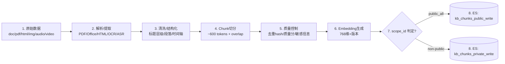
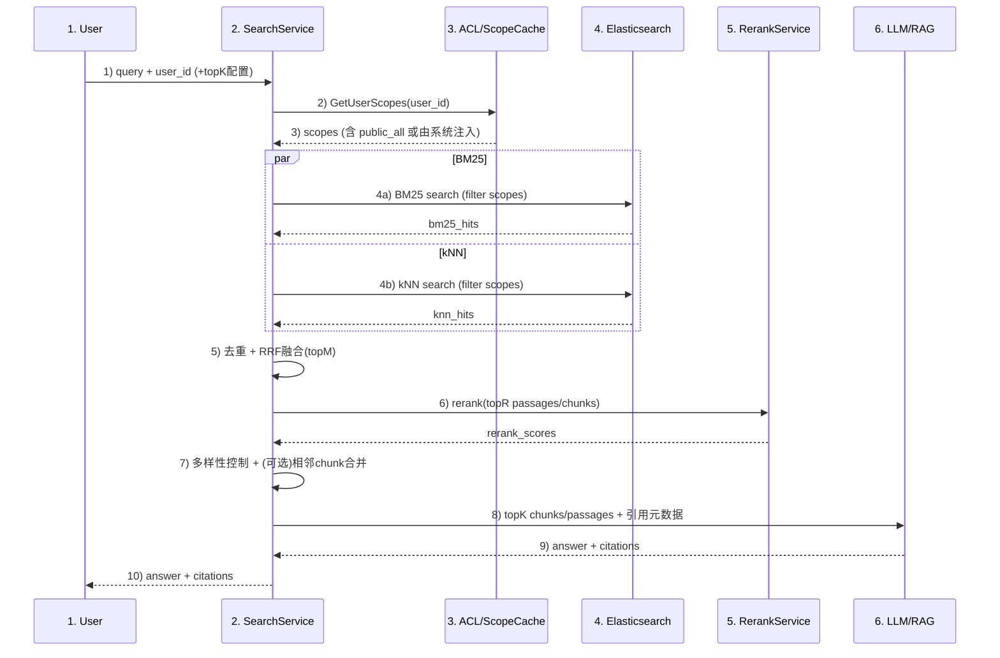
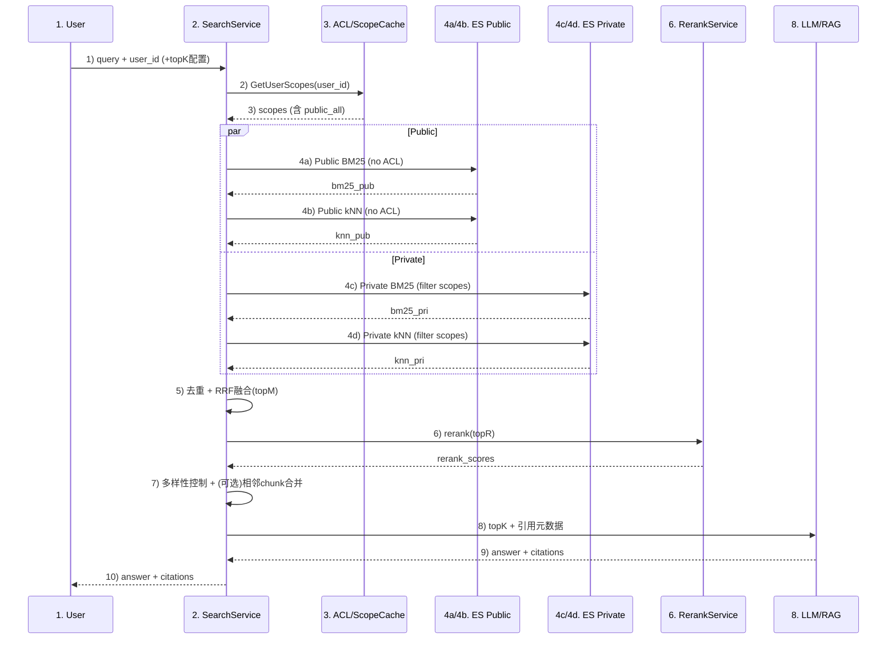
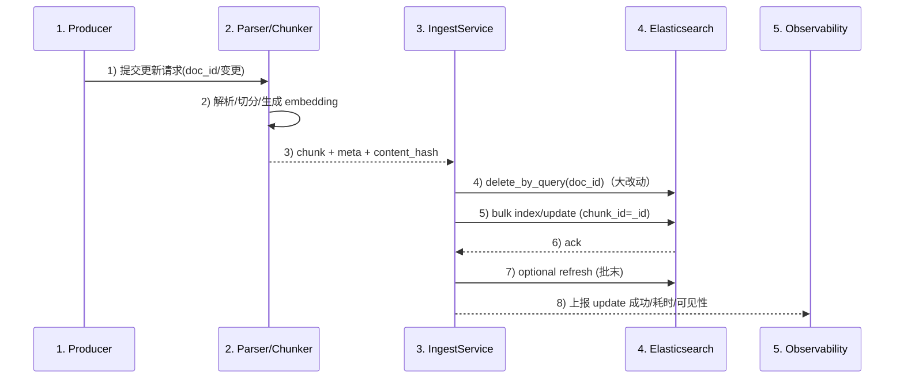
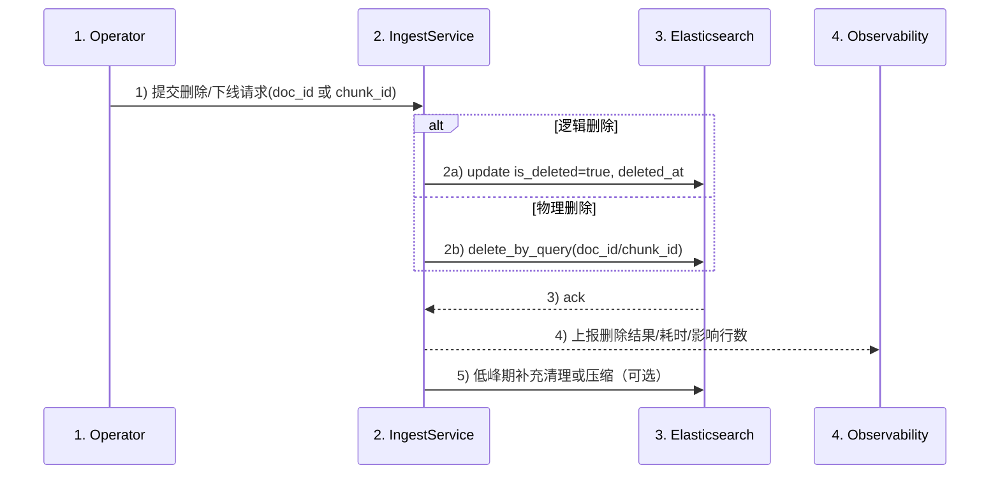
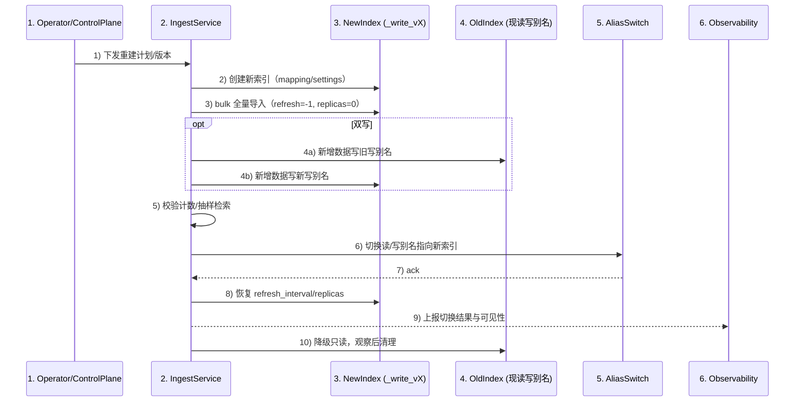
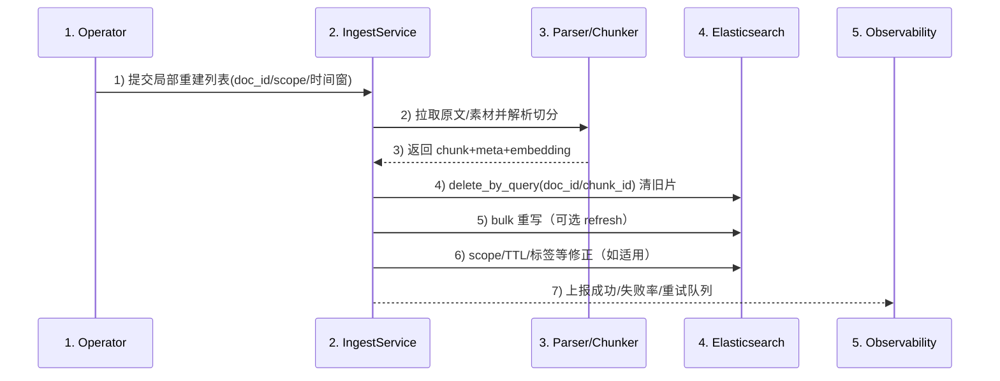

# 容翼查索引与检索详细设计方案

## 1. 概述
容翼查面向企业内部知识库系统的多类型 KB（Enterprise/Department/Personal/Agent）的进行索引构建、存储。多模态内容（图片/音频/视频）统一转文本后入库；其中文档权限与 `user_id` 关联。为RAG 应用提供高效检索与准确召回服务。  
> 已知或假设约束/现状：  
> - 启动阶段 chunk 规模：约 **100 万**；目标阶段：约 **1000 万**  
> - **70% chunk 为全员可见（public）**  
> - 查询模式：**全局在用户可见范围内搜索**（不指定 kb_id）  
> - embedding：**768 维**  
> - chunk 平均：约 **600 tokens**  
> - Hybrid 检索占比：约 **95%**（BM25 + kNN）  
> - 需要 **rerank**，必要时再叠加 LLM rerank。

## 2. 目标

- 支持 **关键词检索（BM25）+ 语义向量检索（kNN/HNSW）+ Hybrid 融合 + Rerank**
- 文档、图片、音频/视频等多模态内容统一对齐为文本语义
- 权限仅与 `user_id` 关联，**越权召回率必须为 0**
- 可从 100 万 chunk 平滑演进至 1000 万 chunk


## 3. 总体架构

### 3.1 设计要点
1. **权限采用 scope_id 抽象** 
2. **最小可行版本（MVP） 阶段先单索引**（100 万 chunk）快速上线，统一 `scope_id` 过滤  
3. **规模化(Scale) 阶段（千万级）：
   - 拆 public、private 索引，专业库索引；  
   - public 索引不做 ACL filter
   - private 索引强制 ACL pre-filter（越权=0）  
4. **Hybrid 95% + rerank 必选**：召回窗口适中（chunk 600 tokens，不必过大），再用 rerank 提升精度  
5. 多模态内容：统一 多模态模型识别/OCR/ASR 成文本后生成 text embedding
6. **语义增强（全量 & 切片）**：
  - 全文档级：分类（doc_type/业务域）、摘要（long/short）、关键词、问题、标签。
  - 切片级（chunk/keyframe）：局部摘要、关键词、问题（chunk-level Q）、标签；用于 rerank 与多样性控制。
  - 存储：将结构化信号写入字段（如 `doc_meta` / `chunk_meta`），向量化摘要/问题/标签入向量。

## 4. 权限模型

### 4.1 设计原则
- 权限只与 `user_id` 关联，但为了高性能检索，需要把授权集合抽象为小规模集合标识：`scope_id`
- 每个 chunk 归属一个 `scope_id`

### 4.2 scope_id 约定
- `public_all`：全员可见（约 70% chunk）
- 其它：部门/项目/KB共享/个人/agent 等，均映射为 scope_id

### 4.3 ACL 数据与缓存
- ACL 服务：`GetUserScopes(user_id) -> [scope_id...]`
- `public_all` 可由系统默认注入（不必在 ACL 存所有用户）
- 缓存：Redis + 本地 LRU  
  - TTL：1~5 分钟  
  - 权限变更：事件驱动主动失效（优先）

### 4.4 越权=0 的保证
- 任何涉及 private 内容的 ES 查询必须带：`terms scope_id in user_scopes`（filter context）
- 防御性兜底：服务端可二次校验 scope


## 5. 索引设计

### 5.1 单索引
- 索引：`kb_chunks_v1`
- public/private 都在一个索引内，通过 `scope_id` 区分
- 所有查询统一 `terms scope_id in user_scopes`

**优点**：快速上线、运维简单  
**缺点**：到千万级时，public 也走 ACL filter 会浪费资源（进入 Scale 解决）

### 5.2 public/private 双索引
- `kb_chunks_public_v1`：仅 scope_id=public_all  
- `kb_chunks_private_v1`：scope_id!=public_all  

检索改为四路并行：  
- public BM25 + public kNN（无 ACL filter）  
- private BM25 + private kNN（强制 ACL filter）  
融合 + rerank 后统一返回

### 5.3 private 分业务库
- 按业务/部门/租户拆分私有索引：如 `kb_chunks_private_finance_v1`、`kb_chunks_private_hr_v1`、`kb_chunks_private_it_v1`；公共仍用 `kb_chunks_public_v1`。
- 检索路由：
  - 公共索引：仍走 public BM25/kNN（无 ACL filter）。
  - 私有索引：依据用户 scopes 推导出所属业务索引集合，仅在相关私有索引上并行 BM25+kNN（仍带 scope_id filter，防越权）。
- 优点：降低私有查询的 shard fanout（只打命中的业务库）、减少 ACL filter 对无关业务数据的浪费、便于业务级扩缩容与独立演进。
- 成本/注意：索引数量上升（控制业务库数量，避免指数爆炸），Ingest 需按业务库路由写入；跨业务检索需多索引并行融合；监控与容量规划按业务索引粒度进行。

## 6. 索引构建（Ingestion）流程

### 6.1 文本类
- 解析：PDF/Office/HTML/Markdown/TXT/邮件/工单/IM 等
- 清洗：去噪、去模板、保留标题层级与结构
- chunk：平均 600 tokens，overlap 80~120（范围：400~800 tokens）
- 生成 embedding：768 维，写入 `embedding_model/embedding_version`

### 6.2 多模态统一转文本
- 图片：OCR → 文本 → chunk → embedding
- 音频：ASR → transcript → chunk（时间段+token上限）→ embedding
- 视频：字幕/ASR/frame → transcript → chunk（章节/时间段）→ embedding
- 保留媒体定位字段：`start_ms/end_ms`

### 6.3 质量
- 去重：`content_hash`（SHA1/xxhash）  
- 质量分：`quality_score`（可由解析质量、内容完整度、来源可信度计算）  
- 幂等写入：`chunk_id` 作为 ES `_id`


## 7. Mapping 模板（JSON 示例）

```json
PUT kb_chunks_v1
{
  "settings": {
    "number_of_shards": 3,
    "number_of_replicas": 1,
    "refresh_interval": "10s",
    "analysis": {
      "analyzer": {
        "zh_smart": {
          "type": "ik_smart"
        },
        "zh_max": {
          "type": "ik_max_word"
        },
        "en_std": {
          "type": "standard"
        },
        "pinyin_analyzer": {
          "tokenizer": "standard",
          "filter": [
            "lowercase",
            "my_pinyin"
          ]
        }
      },
      "filter": {
        "my_pinyin": {
          "type": "pinyin",
          "keep_full_pinyin": true,
          "keep_first_letter": true,
          "keep_separate_first_letter": false,
          "keep_joined_full_pinyin": true,
          "keep_original": true,
          "limit_first_letter_length": 16,
          "remove_duplicated_term": true
        }
      }
    }
  },
  "mappings": {
    "dynamic": "strict",
    "properties": {
      "kb_id": { "type": "keyword" },
      "kb_type": { "type": "keyword" },

      "scope_id": { "type": "keyword" },

      "doc_id": { "type": "keyword" },
      "chunk_id": { "type": "keyword" },
      "chunk_index": { "type": "integer" },

      "language": { "type": "keyword" },

      "title": {
        "properties": {
          "zh": {
            "type": "text",
            "analyzer": "zh_smart",
            "fields": {
              "max": { "type": "text", "analyzer": "zh_max" },
              "pinyin": { "type": "text", "analyzer": "pinyin_analyzer" },
              "keyword": { "type": "keyword", "ignore_above": 256 }
            }
          },
          "en": { "type": "text", "analyzer": "en_std" }
        }
      },
      "content": {
        "properties": {
          "zh": {
            "type": "text",
            "analyzer": "zh_smart",
            "fields": {
              "max": { "type": "text", "analyzer": "zh_max" },
              "pinyin": { "type": "text", "analyzer": "pinyin_analyzer" }
            }
          },
          "en": { "type": "text", "analyzer": "en_std" }
        }
      },

      "source_type": { "type": "keyword" },
      "doc_type": { "type": "keyword" },

      "created_at": { "type": "date" },
      "updated_at": { "type": "date" },

      "quality_score": { "type": "float" },
      "tags": { "type": "keyword" },
      "content_hash": { "type": "keyword" },

      "start_ms": { "type": "long" },
      "end_ms": { "type": "long" },

      "embedding_model": { "type": "keyword" },
      "embedding_version": { "type": "keyword" },

      "embedding": {
        "type": "dense_vector",
        "dims": 768,
        "index": true,
        "similarity": "cosine"
      }
    }
  }
}
```

## 8. 分片/副本/写入/生命周期

### 8.1 MVP
- shards：3~6（优先 3，视节点数）
- replicas：1（资源紧张可临时 0）
- refresh_interval：10s

### 8.2 Scale
- public（700 万）：shards=12（8~16），replicas=1  
- private（300 万）：shards=6（4~8），replicas=1  

### 8.3 bulk 写入
- 每批 5~15MB（或 1000~5000 docs/批，按 doc 大小调）
- 并发 2~8（视集群与写入时段）
- 大导入：refresh=-1 → 导入完成恢复 → 低峰期优化 segment


## 9. 检索设计

### 9.1 默认参数
- BM25 size：200（150~400）
- kNN：k=150（100~250），num_candidates=2000（1000~6000）
- 融合 topM：150~200
- rerank topR：60~120（默认 100）
- 输出 topK：10/20/40（默认 20）

### 9.2 单索引 BM25 DSL（简要示例）
```json
POST kb_chunks_v1/_search
{
  "size": 200,
  "track_total_hits": false,
  "timeout": "250ms",
  "query": {
    "bool": {
      "filter": [
        { "terms": { "scope_id": ["public_all","dept_finance","project_abc"] } }
      ],
      "must": [
        {
          "multi_match": {
            "query": "差旅报销流程怎么走",
            "fields": ["title.zh^3","content.zh","title.en^2","content.en"],
            "type": "best_fields"
          }
        }
      ]
    }
  }
}
```

### 9.3 单索引 kNN DSL（必须 pre-filter，简要示例）
```json
POST kb_chunks_v1/_search
{
  "size": 150,
  "track_total_hits": false,
  "timeout": "400ms",
  "knn": {
    "field": "embedding",
    "query_vector": [0.01, 0.02, "..."],
    "k": 150,
    "num_candidates": 2000,
    "filter": {
      "bool": {
        "filter": [
          { "terms": { "scope_id": ["public_all","dept_finance","project_abc"] } }
        ]
      }
    }
  }
}
```

### 9.4 Hybrid 融合（RRF）
- 对 BM25 与 kNN 返回结果做去重（按 chunk_id）
- RRF：`score = Σ 1/(k0 + rank_i)`，k0=60
- 融合后取 topM=200 → 进入 rerank topR=100


## 10. 上下文构建

### 10.1 topK 动态使用
- topK=10：明确问答/制度条款  
- topK=20（默认）：通用问题  
- topK=40：复杂问题/需要多证据链/长问题

### 10.2 多样性约束
- 同一 doc 最多返回 2~4 个 chunk（避免单文档垄断）
- chunk 去重：同 doc 高相似内容只留高分

### 10.3 相邻 chunk 轻合并
- 若 topK 中同 doc 相邻 chunk（chunk_index 连续），可拼接成更完整段落再送入 LLM  
- 控制总 token 预算（例如 8k/16k），避免上下文过长


## 11. Rerank 方案

- **默认**：对 BM25+kNN 融合后的候选做重排序。
- **RerankService**：cross-encoder rerank，选用 `bge-reranker-base`（中英双语），batch 可 8~16，超时/高压可降 batch 或降 topR。
- **可选：LLM rerank**（默认不开启）。仅对前 20~50 条做二次判别，成本高。
- **特征融合**：可叠加 freshness（updated_at 越新越好）、quality_score、媒体置信度（asr/ocr_confidence）进行线性/学习到排序的加权。
- **性能提示**：rerank 额外时延通常 200~800ms；若超时/高压可动态调低 topR 或关闭 LLM rerank。

---

## 12. 流程图

### 12.1 索引构建


**索引构建详细步骤**
1) 原始数据进入解析（支持 PDF/Office/HTML/OCR/ASR）。
2) 清洗/结构化，保留标题层级、段落与时间轴信息。
3) Chunk 切分。
4) 质量控制：去重 hash、质量分、敏感信息过滤。
5) 生成 Embedding（768 维，记录 embedding_model/version）。
6) 判定 scope_id：public_all 走公共，其余走私有。
7) 写入对应索引：public → `kb_chunks_public_write`，non-public → `kb_chunks_private_write`。

### 12.2 检索


**检索详细步骤**
1) 用户输入 query，附带 user_id（可选 topK 配置）。
2) 获取用户 scopes（含默认注入的 public_all）。
3) 并行检索：BM25 与 kNN 均按 scopes 做 pre-filter。
4) 去重 + RRF 融合得到 topM。
5) 对 topR 做 rerank（默认 cross-encoder，可选 LLM rerank）。
6) 多样性控制，必要时相邻 chunk 合并。
7) 取 topK 作为上下文送入 LLM/RAG，返回答案与引用。

**四路检索（public/private）时序图**


**四路检索详细步骤**
1) 用户输入 query + user_id（可选 topK 配置）。
2) 获取用户 scopes（含默认注入 public_all）。
3) 四路并行召回：4a 公共 BM25（无 ACL）；4b 公共 kNN（无 ACL）；4c 私有 BM25（带 ACL filter）；4d 私有 kNN（带 ACL filter）。
4) 汇总四路结果，按 chunk_id 去重并做 RRF 融合得到 topM。
5) 对 topR 做 rerank（默认 cross-encoder，可选 LLM rerank）。
6) 多样性控制，必要时相邻 chunk 合并。
7) 取 topK 作为上下文送入 LLM/RAG。
8) LLM 返回 answer + citations。
9) 返回给用户。

> Scale 阶段把 ES 查询拆成 public/private 四路并行即可（public 不带 ACL filter；private 带 filter）。

## 14. 数据更新、索引更新

- 适用场景：文档替换、增量更新、矫正 OCR/ASR、重新分片（切分规则变更）
- 策略
  - 小改动（元数据/标题/标签/quality_score 等）：`update` 局部字段；保持 `content_hash` 与版本。
  - 大改动（正文变化/重新切分）：先删除旧 chunk（同 `doc_id`），重新解析→切分→重建 embedding→批量写入。
  - 语义增强变更：重新生成摘要/关键词/问题后，更新对应字段与向量；保留旧 `chunk_id` 以维持引用稳定性。
- 幂等与一致性
  - `chunk_id` 作为 `_id`；写入前可对比 `content_hash`，不变则跳过。
  - 写入走 bulk，`refresh_interval` 保持 10s（或批量结束后手动 refresh）。
  - 更新后可按 `doc_id` 做一次校验查询，确认 chunk 数与期望一致。
- 触发与回滚
  - 触发：文档存储更新事件、手动重建请求、解析/质量评分提升。
  - 回滚：保留旧版本副本（如 `kb_chunks_backup`）或在同索引加 `version` 字段；必要时按版本回放。
- 观察指标：update 延迟、失败率、刷新后可见性（写入-可见时间），以及更新前后检索 nDCG/Recall 变化。

**数据更新时序图**


**数据更新步骤（对应时序）**
1) Producer 侧识别并提交变更：小改（元数据/标签/质量分）、大改（正文/重切分）、语义增强重算。
2) Parser/Chunker：解析→切分→生成 embedding 与结构化信号，产出 chunk + meta + content_hash。
3) IngestService 执行写前策略：大改按 doc_id 先 delete_by_query，小改走 bulk update。
4) Bulk 写入：chunk_id 作为 `_id`；批末可选 refresh 以缩短可见性延迟。
5) 校验：按 doc_id 统计 chunk 数、抽样检索确认可见性与字段更新正确。
6) 观测与回报：上报写入耗时、可见性、失败率、以及变更前后的 nDCG/Recall 变化。

## 15. 数据删除、索引更新

- 适用场景：文档下线、权限收回、纠错删除、留存期到期（TTL）
- 策略
  - 逻辑删除：设置 `is_deleted=true` + `deleted_at`（可选保留 7~30 天），检索 filter `is_deleted=false`；便于恢复。
  - 物理删除：按 `doc_id`/`chunk_id` 批量 `delete_by_query`；大批量可分批 + `scroll_size` 控制。
  - 权限收回：仅改 `scope_id`，无需删除；确保 ACL 缓存失效。
  - 留存/TTL：使用 ILM（hot→warm→delete）或应用侧定期 `delete_by_query`，条件 `updated_at < now-ttl` 或 `expires_at < now`。
- 幂等与安全
  - 删除操作记录审计，携带操作者与理由。
  - 物理删除前可写入 tombstone（`is_deleted=true`）并延时真正删除，防止误删。
- 验证与旁路
  - 删除后按 `doc_id` 采样查询确认无残留。
  - 高峰期可降级为逻辑删，低峰期再物理清理。

**数据删除时序图**


**数据删除步骤（对应时序）**
1) Operator 提交删除/下线请求，选择策略：逻辑删（可恢复）或物理删（永久）。
2) IngestService 执行：逻辑删用 update 设置 `is_deleted=true, deleted_at`；物理删用 delete_by_query（doc_id/chunk_id）。
3) 权限收回场景：仅更新 `scope_id` 并失效 ACL 缓存，无需删除数据。
4) 容错/防误删：需要可恢复时先写 tombstone（逻辑删），延迟物理删除；大批量按批次控制 `scroll_size`。
5) 验证与审计：按 doc_id 抽样查询确认无残留，记录操作者、原因、影响行数和耗时。
6) 后处理：低峰期补充物理清理与 segment 优化，持续上报删除结果、失败率与可见性指标。

## 16. 规模分级的资源开销与复杂度

- 假设：平均 600 tokens/chunk（约 1.5KB 文本），embedding 768 dims float32（~3KB），HNSW M=16，70% public，30% private。
- 单 chunk 估算：文本+倒排 ~2.5KB；向量 ~3KB；HNSW 图额外 ~1.5KB；元数据/存储开销 ~0.5KB → 合计约 7.5KB/条。

| 规模 | 公共:私有 chunk | 向量+HNSW (GB) | 文本+倒排+元数据 (GB) | 估算总磁盘 (GB) | 内存热集建议 |
| --- | --- | --- | --- | --- | --- |
| 100 万 | 70 万 : 30 万 | ~7.0 | ~2.5 | ~9.5 | HNSW 索引所在节点预留 1.5x 向量内存 (~10GB) |
| 1000 万 | 700 万 : 300 万 | ~70 | ~25 | ~95 | 预留 1.5x (~105GB)；拆 public/private，控制 shard fanout |
| 5000 万 | 3500 万 : 1500 万 | ~350 | ~125 | ~475 | 只向量热集放缓存，余量走 mmap；必要时分业务私有库（5.3） |

### 检索空间/时间复杂度（粗略）
- BM25 倒排：
  - 空间：O(N * avg_terms)；增量随文本长度线性增长。
  - 查询：O(sum df) 读取匹配倒排 + O(topM log topM) 排序；shard fanout 影响常数项。
- HNSW kNN：
  - 空间：O(N * (dims + M))，约等于向量存储 1.3~1.6x。
  - 建图：O(N * M * log N)。
  - 查询：O(M * log N + ef_search)；ef_search 越大召回越高但延迟线性升高。
- Hybrid（BM25+kNN+RRF+rerank）：
  - 空间：BM25 + 向量 + 图索引总和。
  - 时间：BM25 查询 + HNSW 查询 + RRF 去重/融合 O(topM) + rerank O(topR * d_ce)（d_ce 为 cross-encoder 维度）。

### 容量规划与调优提示
- 规模 100 万：单索引足够；shards=3~6，replica=1；rerank topR=100；num_candidates=2000。
- 规模 1000 万：拆 public/private（5.2），必要时私有分业务库（5.3）；public shards=8~16，private shards=4~8；控制 fanout。
- 规模 5000 万：
  - 私有索引按业务/租户拆分，公共索引横向扩 shard；
  - HNSW 内存压缩：调低 M 或使用 quantization；
  - 性能瓶颈时先降 num_candidates/ef_search，再降 topR，必要时 BM25-only。

## 17. 全量索引重建

- 触发场景：Mapping 变更、embedding 模型/切分规则升级、质量/安全策略调整（去重、敏感过滤）、冷热分层/ILM 改造。
- 基本策略：影子索引 + 切换别名（零停机）；如需保守，可在切换前短暂停写或开启双写（旧写 alias 与新写 alias 并行）。
- 索引与别名约定：`kb_chunks_public_write_vX`/`kb_chunks_private_write_vX` 与读别名 `kb_chunks_public`/`kb_chunks_private`，切换时仅改别名指向。

**全量重建时序图**


**重建步骤**
1) 规划版本与容量：确定 shards/replicas、refresh_interval（大导入设置为 -1）、字段/向量配置。
2) 创建新索引：按新 Mapping/Settings 建 `*_write_vX`；必要时预热 analyzer/向量模型。
3) 全量导入：关闭 replica、refresh=-1；批量 5~15MB，滚动 bulk；导入期间保持旧索引对外提供读。
4) 可选双写：在 IngestService 同步写旧写别名与新写别名，确保重建期间新增数据不丢。
5) 校验：
  - 计数：对 doc_id/chunk 数、scope 分布做对比。
  - 质量：抽样检索回归（BM25/kNN/Hybrid），检查越权=0、相关性不回退。
6) 切换：暂停 ingest 数秒（或利用双写保持持续写），更新读/写别名指向新索引；恢复 refresh_interval、replica=1。
7) 清理：旧索引降级为只读，观测 24~72 小时后删除或留作回滚；必要时 force merge 新索引降低 segment。

**观测与回滚**
- 监控导入速率、reject、磁盘、GC；检索延迟与 nDCG/Recall 变化。
- 出现问题可将读/写别名切回旧索引；若启用双写，可增量重放差异后再次切换。

## 18. 局部索引重建

- 触发场景：单文档/单库纠错，模型/切分升级的局部试点，特定 scope 的脱敏/清洗，时间窗口补数据。
- 范围选择：按 doc_id/KB_id/scope_id/tag/时间段；生成待处理列表（可来自日志、审计、比对任务）。

**局部重建时序图**


**局部重建步骤**
1) 选定重建集：拉取待修复 doc_id 列表或按条件扫描（避免全表 scan，可按 updated_at 分片）。
2) 重跑解析与切分：Parser/Chunker 输出新的 chunk、meta、content_hash；必要时更新 embedding/语义增强。
3) 写前处理：按 doc_id 先 delete_by_query（或按 chunk_id 精确删除），防止旧数据残留；scope 变更时一并写入新 scope。
4) Bulk 写入：遵循批量大小与并发限流，优先低峰执行；批末可选 refresh。
5) 校验：对重建集合做计数与抽样检索，确认字段、ACL、向量更新生效；异常记录重试队列。
6) 收尾：上报影响行数/耗时/失败率；必要时在特定 scope 触发缓存失效（ACL/user_scopes）。

- 性能提示：局部重建默认不切换别名；仅影响目标 doc_id 的删除+重写，线上读流量受影响极小。对大批量局部重建可分批/分 scope 推进，避免与高峰检索抢资源。

## 19. 可观测性、压测与降级策略

### 19.1 监控指标
- BM25/kNN 延迟（P50/P95/P99）
- 融合耗时、rerank 耗时
- 质量指标：Recall@K、nDCG、越权召回率（必须=0）

### 19.2 压测测试
- 使用真实 query 回放（>= 1~2 万）
- 三档：日常 20 QPS、峰值 100 QPS、极限 150 QPS（验证扩容策略）
- 分别测 topK=10/20/40 与 rerank on/off

### 19.3 降级策略
当 ES reject/排队、或整体超时接近阈值：
1. 降 `num_candidates`  
2. 降 `k`  
3. 降 `topR`（rerank 输入更小）  
4. 必要时 BM25-only（保证可用）

## 20. 风险与备选方案

1. 千万级时 public 过滤浪费资源  
- 解决：public/private 拆索引

2. Hybrid 95% + rerank 成本高  
- 解决：只 rerank topR；动态 rerank（仅对复杂问题启用更大 topR 或 LLM rerank）

3. 多模态转写噪声  
- 解决：置信度入库 + rerank 降权；必要时媒体单独索引并在融合时控权重


## 21. 术语表

| 术语 | 解释 |
| --- | --- |
| ACL (Access Control List) | 访问控制列表；用于限定用户可见的资源范围，文中通过 `scope_id` 过滤实现。 |
| Alias switch | 通过读/写别名切换到新索引，实现零停机切换。 |
| asr/ocr_confidence | 媒体置信度；来源于 ASR/OCR 的置信度，排序时可对低置信度内容降权。 |
| avg_terms | 每条文档或 chunk 的平均倒排词项数，用于估算倒排空间与查询复杂度。 |
| BM25 | 经典关键词匹配算法；用于文本倒排索引的相关性评分。 |
| d_ce | cross-encoder 模型的隐维或 token 表征维度，决定 rerank 计算量。 |
| delete_by_query | ES 按查询条件批量删除的 API，常用于按 doc_id/chunk_id 清理旧片。 |
| df (Document Frequency) | 倒排中的文档频次，表示包含某词项的文档/段落数量；影响 BM25 查询读取的 posting 数量。 |
| Dual-write | 重建期间同时向旧写别名和新写别名写入，避免增量丢失。 |
| ef_search | HNSW 查询阶段的候选窗口，越大召回越高但查询延迟线性上升。 |
| force merge | ES 段合并操作，降低 segment 数以优化查询/存储，在重建或大删后使用。 |
| freshness | 新鲜度特征；通常用 `updated_at`，越新权重越高。 |
| Hybrid 检索 | 将 BM25 与向量检索并行召回后融合（如 RRF），兼顾语义与关键词匹配。 |
| HNSW M | HNSW 图的出度参数（每层的近邻数），典型 12~32；M 越大召回好但建索/存储/查询成本上升。 |
| Idempotency (幂等) | 同一操作重复执行结果一致；在写入/更新时依赖固定 `_id`（如 chunk_id）与 `content_hash` 变更检测，避免重复插入或误重放。 |
| ILM (Index Lifecycle Management) | 索引生命周期管理策略，用于 hot→warm→delete 的自动迁移或删除。 |
| kNN / HNSW | 基于向量的最近邻检索；HNSW 是常用的近似 kNN 图索引结构。 |
| LLM rerank | 使用大模型对候选结果做二次判别与重排（默认关闭，仅对前 20~50 条，成本高）。 |
| LRU (Least Recently Used) | 最近最少使用淘汰策略；用于缓存（如用户 scope 缓存）时的内存控制。 |
| MVP (Minimum Viable Product) | 最小可行版本；在早期用最小单索引方案（如 3~6 shards、1 replica、refresh_interval=10s）快速上线验证。 |
| nDCG (Normalized Discounted Cumulative Gain) | 排序质量指标；公式：$nDCG@k = \dfrac{DCG@k}{IDCG@k}$，其中 $DCG@k = \sum_{i=1}^{k} \dfrac{2^{rel_i}-1}{\log_2(i+1)}$，$rel_i$ 为位置 $i$ 的相关性等级，$IDCG@k$ 为理想排序下的 $DCG@k$。 |
| num_candidates | 向量检索的初筛候选数（如 2000；可按 1000~6000 调节），影响召回和性能。 |
| quality_score | 质量分；可基于解析质量、完整度、可信度等生成，供排序加权。 |
| refresh_interval | 刷新间隔；MVP 建议 10s，兼顾写入性能与搜索时效。 |
| replicas | 副本数；默认 1，资源紧张可临时调为 0。 |
| rerank | 对已召回候选重新排序（通常用 cross-encoder，必要时叠加 LLM），提升精度。 |
| RRF (Reciprocal Rank Fusion) | 召回融合方法，按各路结果的名次进行加权求和，提升多路召回的稳定性。 |
| scope | 权限作用域集合；某用户在一次检索中可用的所有 `scope_id` 列表（含 `public_all`），是 ACL 过滤的输入。 |
| scope_id | 权限作用域标识；将用户可访问的资源集合映射为短标识，以便高效过滤。 |
| Shadow index | 影子索引；先全量导入的新索引，切换别名前不对外提供读。 |
| shards | 分片数；MVP 建议 3~6（优先 3，视节点数调整）。 |
| Tombstone | 逻辑删除标记（如 `is_deleted=true`），便于延迟物理删除与恢复。 |
| topK | 最终返回给 RAG 的结果数（如 10/20/40，默认 20）。 |
| topM | BM25+kNN 融合后的候选窗口（如 150~200），决定进入 rerank 的规模。 |
| topR | rerank 的候选窗口（如 60~120，默认 100），越大越精确但成本更高。 |
| TTL (Time To Live) | 生存时间；缓存项或索引数据的过期时间（如用户 scope 缓存 1~5 分钟），到期后需重新获取或刷新。 |
| 越权=0 | 零越权召回；检索结果中不得返回用户无权限的内容，依赖 `scope_id` 过滤与必要的二次校验保障。 |