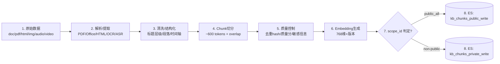
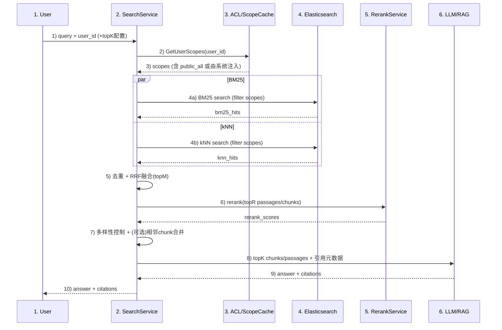
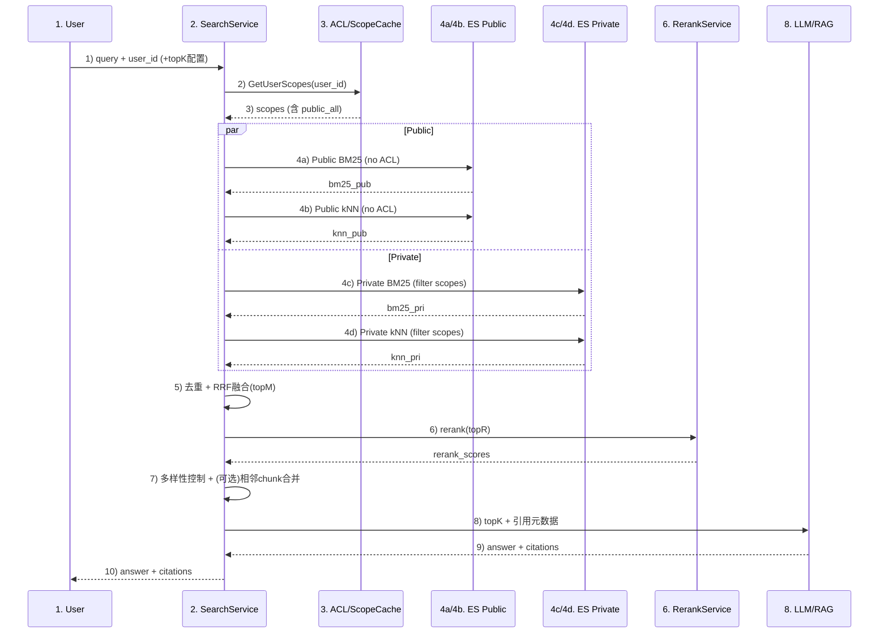

# 容翼查索引与检索详细设计方案

## 1. 概述
容翼查面向企业内部知识库系统的多类型 KB（Enterprise/Department/Personal/Agent）的进行索引构建、存储。多模态内容（图片/音频/视频）统一转文本后入库；其中文档权限与 `user_id` 关联。为RAG 应用提供高效检索与准确召回服务。  
> 已知或假设约束/现状：  
> - 启动阶段 chunk 规模：约 **100 万**；目标阶段：约 **1000 万**  
> - **70% chunk 为全员可见（public）**  
> - 查询模式：**全局在用户可见范围内搜索**（不指定 kb_id）  
> - embedding：**768 维**  
> - chunk 平均：约 **600 tokens**  
> - Hybrid 检索占比：约 **95%**（BM25 + kNN）  
> - 需要 **rerank**，必要时再叠加 LLM rerank。

## 2. 目标

- 支持 **关键词检索（BM25）+ 语义向量检索（kNN/HNSW）+ Hybrid 融合 + Rerank**
- 文档、图片、音频/视频等多模态内容统一对齐为文本语义
- 权限仅与 `user_id` 关联，**越权召回率必须为 0**
- 可从 100 万 chunk 平滑演进至 1000 万 chunk


## 3. 总体架构

### 3.1 设计要点
1. **权限采用 scope_id 抽象** 
2. **最小可行版本（MVP） 阶段先单索引**（100 万 chunk）快速上线，统一 `scope_id` 过滤  
3. **规模化(Scale) 阶段（千万级）：
   - 拆 public、private 索引，专业库索引；  
   - public 索引不做 ACL filter
   - private 索引强制 ACL pre-filter（越权=0）  
4. **Hybrid 95% + rerank 必选**：召回窗口适中（chunk 600 tokens，不必过大），再用 rerank 提升精度  
5. 多模态内容：统一 多模态模型识别/OCR/ASR 成文本后生成 text embedding
6. **语义增强（全量 & 切片）**：
  - 全文档级：分类（doc_type/业务域）、摘要（long/short）、关键词、问题、标签。
  - 切片级（chunk/keyframe）：局部摘要、关键词、问题（chunk-level Q）、标签；用于 rerank 与多样性控制。
  - 存储：将结构化信号写入字段（如 `doc_meta` / `chunk_meta`），向量化摘要/问题/标签入向量。

## 4. 权限模型

### 4.1 设计原则
- 权限只与 `user_id` 关联，但为了高性能检索，需要把授权集合抽象为小规模集合标识：`scope_id`
- 每个 chunk 归属一个 `scope_id`

### 4.2 scope_id 约定
- `public_all`：全员可见（约 70% chunk）
- 其它：部门/项目/KB共享/个人/agent 等，均映射为 scope_id

### 4.3 ACL 数据与缓存
- ACL 服务：`GetUserScopes(user_id) -> [scope_id...]`
- `public_all` 可由系统默认注入（不必在 ACL 存所有用户）
- 缓存：Redis + 本地 LRU  
  - TTL：1~5 分钟  
  - 权限变更：事件驱动主动失效（优先）

### 4.4 越权=0 的保证
- 任何涉及 private 内容的 ES 查询必须带：`terms scope_id in user_scopes`（filter context）
- 防御性兜底：服务端可二次校验 scope


## 5. 索引设计

### 5.1 单索引
- 索引：`kb_chunks_v1`
- public/private 都在一个索引内，通过 `scope_id` 区分
- 所有查询统一 `terms scope_id in user_scopes`

**优点**：快速上线、运维简单  
**缺点**：到千万级时，public 也走 ACL filter 会浪费资源（进入 Scale 解决）

### 5.2 public/private 双索引
- `kb_chunks_public_v1`：仅 scope_id=public_all  
- `kb_chunks_private_v1`：scope_id!=public_all  

检索改为四路并行：  
- public BM25 + public kNN（无 ACL filter）  
- private BM25 + private kNN（强制 ACL filter）  
融合 + rerank 后统一返回

## 6. 索引构建（Ingestion）流程

### 6.1 文本类
- 解析：PDF/Office/HTML/Markdown/邮件/工单/IM 等
- 清洗：去噪、去模板、保留标题层级与结构
- chunk：平均 600 tokens，overlap 80~120（范围：400~800 tokens）
- 生成 embedding：768 维，写入 `embedding_model/embedding_version`

### 6.2 多模态统一转文本
- 图片：OCR → 文本 → chunk → embedding
- 音频：ASR → transcript → chunk（时间段+token上限）→ embedding
- 视频：字幕/ASR/frame → transcript → chunk（章节/时间段）→ embedding
- 保留媒体定位字段：`start_ms/end_ms`

### 6.3 质量
- 去重：`content_hash`（SHA1/xxhash）  
- 质量分：`quality_score`（可由解析质量、内容完整度、来源可信度计算）  
- 幂等写入：`chunk_id` 作为 ES `_id`


## 7. Mapping 模板（JSON 示例）

```json
PUT kb_chunks_v1
{
  "settings": {
    "number_of_shards": 3,
    "number_of_replicas": 1,
    "refresh_interval": "10s",
    "analysis": {
      "analyzer": {
        "zh_smart": {
          "type": "ik_smart"
        },
        "zh_max": {
          "type": "ik_max_word"
        },
        "en_std": {
          "type": "standard"
        },
        "pinyin_analyzer": {
          "tokenizer": "standard",
          "filter": [
            "lowercase",
            "my_pinyin"
          ]
        }
      },
      "filter": {
        "my_pinyin": {
          "type": "pinyin",
          "keep_full_pinyin": true,
          "keep_first_letter": true,
          "keep_separate_first_letter": false,
          "keep_joined_full_pinyin": true,
          "keep_original": true,
          "limit_first_letter_length": 16,
          "remove_duplicated_term": true
        }
      }
    }
  },
  "mappings": {
    "dynamic": "strict",
    "properties": {
      "kb_id": { "type": "keyword" },
      "kb_type": { "type": "keyword" },

      "scope_id": { "type": "keyword" },

      "doc_id": { "type": "keyword" },
      "chunk_id": { "type": "keyword" },
      "chunk_index": { "type": "integer" },

      "language": { "type": "keyword" },

      "title": {
        "properties": {
          "zh": {
            "type": "text",
            "analyzer": "zh_smart",
            "fields": {
              "max": { "type": "text", "analyzer": "zh_max" },
              "pinyin": { "type": "text", "analyzer": "pinyin_analyzer" },
              "keyword": { "type": "keyword", "ignore_above": 256 }
            }
          },
          "en": { "type": "text", "analyzer": "en_std" }
        }
      },
      "content": {
        "properties": {
          "zh": {
            "type": "text",
            "analyzer": "zh_smart",
            "fields": {
              "max": { "type": "text", "analyzer": "zh_max" },
              "pinyin": { "type": "text", "analyzer": "pinyin_analyzer" }
            }
          },
          "en": { "type": "text", "analyzer": "en_std" }
        }
      },

      "source_type": { "type": "keyword" },
      "doc_type": { "type": "keyword" },

      "created_at": { "type": "date" },
      "updated_at": { "type": "date" },

      "quality_score": { "type": "float" },
      "tags": { "type": "keyword" },
      "content_hash": { "type": "keyword" },

      "start_ms": { "type": "long" },
      "end_ms": { "type": "long" },

      "embedding_model": { "type": "keyword" },
      "embedding_version": { "type": "keyword" },

      "embedding": {
        "type": "dense_vector",
        "dims": 768,
        "index": true,
        "similarity": "cosine"
      }
    }
  }
}
```

## 8. 分片/副本/写入/生命周期

### 8.1 MVP
- shards：3~6（优先 3，视节点数）
- replicas：1（资源紧张可临时 0）
- refresh_interval：10s

### 8.2 Scale
- public（700 万）：shards=12（8~16），replicas=1  
- private（300 万）：shards=6（4~8），replicas=1  

### 8.3 bulk 写入
- 每批 5~15MB（或 1000~5000 docs/批，按 doc 大小调）
- 并发 2~8（视集群与写入时段）
- 大导入：refresh=-1 → 导入完成恢复 → 低峰期优化 segment


## 9. 检索设计

### 9.1 默认参数
- BM25 size：200（150~400）
- kNN：k=150（100~250），num_candidates=2000（1000~6000）
- 融合 topM：150~200
- rerank topR：60~120（默认 100）
- 输出 topK：10/20/40（默认 20）

### 9.2 单索引 BM25 DSL（简要示例）
```json
POST kb_chunks_v1/_search
{
  "size": 200,
  "track_total_hits": false,
  "timeout": "250ms",
  "query": {
    "bool": {
      "filter": [
        { "terms": { "scope_id": ["public_all","dept_finance","project_abc"] } }
      ],
      "must": [
        {
          "multi_match": {
            "query": "差旅报销流程怎么走",
            "fields": ["title.zh^3","content.zh","title.en^2","content.en"],
            "type": "best_fields"
          }
        }
      ]
    }
  }
}
```

### 9.3 单索引 kNN DSL（必须 pre-filter，简要示例）
```json
POST kb_chunks_v1/_search
{
  "size": 150,
  "track_total_hits": false,
  "timeout": "400ms",
  "knn": {
    "field": "embedding",
    "query_vector": [0.01, 0.02, "..."],
    "k": 150,
    "num_candidates": 2000,
    "filter": {
      "bool": {
        "filter": [
          { "terms": { "scope_id": ["public_all","dept_finance","project_abc"] } }
        ]
      }
    }
  }
}
```

### 9.4 Hybrid 融合（RRF）
- 对 BM25 与 kNN 返回结果做去重（按 chunk_id）
- RRF：`score = Σ 1/(k0 + rank_i)`，k0=60
- 融合后取 topM=200 → 进入 rerank topR=100


## 10. 上下文构建

### 10.1 topK 动态使用
- topK=10：明确问答/制度条款  
- topK=20（默认）：通用问题  
- topK=40：复杂问题/需要多证据链/长问题

### 10.2 多样性约束
- 同一 doc 最多返回 2~4 个 chunk（避免单文档垄断）
- chunk 去重：同 doc 高相似内容只留高分

### 10.3 相邻 chunk 轻合并
- 若 topK 中同 doc 相邻 chunk（chunk_index 连续），可拼接成更完整段落再送入 LLM  
- 控制总 token 预算（例如 8k/16k），避免上下文过长


## 11. Rerank 方案

- **默认**：对 BM25+kNN 融合后的候选做重排序。
- **可选：LLM rerank**（默认不开启）。仅对前 20~50 条做二次判别，成本高。
- **特征融合**：可叠加 freshness（updated_at 越新越好）、quality_score、媒体置信度（asr/ocr_confidence）进行线性/学习到排序的加权。
- **性能提示**：rerank 额外时延通常 200~800ms；若超时/高压可动态调低 topR 或关闭 LLM rerank。

---

## 12. 流程图

### 12.1 索引构建


**索引构建详细步骤**
1) 原始数据进入解析（支持 PDF/Office/HTML/OCR/ASR）。
2) 清洗/结构化，保留标题层级、段落与时间轴信息。
3) Chunk 切分。
4) 质量控制：去重 hash、质量分、敏感信息过滤。
5) 生成 Embedding（768 维，记录 embedding_model/version）。
6) 判定 scope_id：public_all 走公共，其余走私有。
7) 写入对应索引：public → `kb_chunks_public_write`，non-public → `kb_chunks_private_write`。

### 12.2 检索


**检索详细步骤**
1) 用户输入 query，附带 user_id（可选 topK 配置）。
2) 获取用户 scopes（含默认注入的 public_all）。
3) 并行检索：BM25 与 kNN 均按 scopes 做 pre-filter。
4) 去重 + RRF 融合得到 topM。
5) 对 topR 做 rerank（默认 cross-encoder，可选 LLM rerank）。
6) 多样性控制，必要时相邻 chunk 合并。
7) 取 topK 作为上下文送入 LLM/RAG，返回答案与引用。

**四路检索（public/private）时序图**


**四路检索详细步骤**
1) 用户输入 query + user_id（可选 topK 配置）。
2) 获取用户 scopes（含默认注入 public_all）。
3) 四路并行召回：4a 公共 BM25（无 ACL）；4b 公共 kNN（无 ACL）；4c 私有 BM25（带 ACL filter）；4d 私有 kNN（带 ACL filter）。
4) 汇总四路结果，按 chunk_id 去重并做 RRF 融合得到 topM。
5) 对 topR 做 rerank（默认 cross-encoder，可选 LLM rerank）。
6) 多样性控制，必要时相邻 chunk 合并。
7) 取 topK 作为上下文送入 LLM/RAG。
8) LLM 返回 answer + citations。
9) 返回给用户。

> Scale 阶段把 ES 查询拆成 public/private 四路并行即可（public 不带 ACL filter；private 带 filter）。


## 13. 可观测性、压测与降级策略

### 13.1 监控指标
- BM25/kNN 延迟（P50/P95/P99）
- 融合耗时、rerank 耗时
- 质量指标：Recall@K、nDCG、越权召回率（必须=0）

### 13.2 压测测试
- 使用真实 query 回放（>= 1~2 万）
- 三档：日常 20 QPS、峰值 100 QPS、极限 150 QPS（验证扩容策略）
- 分别测 topK=10/20/40 与 rerank on/off

### 13.3 降级策略
当 ES reject/排队、或整体超时接近阈值：
1. 降 `num_candidates`  
2. 降 `k`  
3. 降 `topR`（rerank 输入更小）  
4. 必要时 BM25-only（保证可用）

## 14. 风险与备选方案

1. 千万级时 public 过滤浪费资源  
- 解决：public/private 拆索引

2. Hybrid 95% + rerank 成本高  
- 解决：只 rerank topR；动态 rerank（仅对复杂问题启用更大 topR 或 LLM rerank）

3. 多模态转写噪声  
- 解决：置信度入库 + rerank 降权；必要时媒体单独索引并在融合时控权重


## 15. 术语表

| 术语 | 解释 |
| --- | --- |
| ACL (Access Control List) | 访问控制列表；用于限定用户可见的资源范围，文中通过 `scope_id` 过滤实现。 |
| asr/ocr_confidence | 媒体置信度；来源于 ASR/OCR 的置信度，排序时可对低置信度内容降权。 |
| BM25 | 经典关键词匹配算法；用于文本倒排索引的相关性评分。 |
| freshness | 新鲜度特征；通常用 `updated_at`，越新权重越高。 |
| Hybrid 检索 | 将 BM25 与向量检索并行召回后融合（如 RRF），兼顾语义与关键词匹配。 |
| kNN / HNSW | 基于向量的最近邻检索；HNSW 是常用的近似 kNN 图索引结构。 |
| LLM rerank | 使用大模型对候选结果做二次判别与重排（默认关闭，仅对前 20~50 条，成本高）。 |
| LRU (Least Recently Used) | 最近最少使用淘汰策略；用于缓存（如用户 scope 缓存）时的内存控制。 |
| MVP (Minimum Viable Product) | 最小可行版本；在早期用最小单索引方案（如 3~6 shards、1 replica、refresh_interval=10s）快速上线验证。 |
| num_candidates | 向量检索的初筛候选数（如 2000；可按 1000~6000 调节），影响召回和性能。 |
| quality_score | 质量分；可基于解析质量、完整度、可信度等生成，供排序加权。 |
| refresh_interval | 刷新间隔；MVP 建议 10s，兼顾写入性能与搜索时效。 |
| replicas | 副本数；默认 1，资源紧张可临时调为 0。 |
| rerank | 对已召回候选重新排序（通常用 cross-encoder，必要时叠加 LLM），提升精度。 |
| RRF (Reciprocal Rank Fusion) | 召回融合方法，按各路结果的名次进行加权求和，提升多路召回的稳定性。 |
| scope | 权限作用域集合；某用户在一次检索中可用的所有 `scope_id` 列表（含 `public_all`），是 ACL 过滤的输入。 |
| scope_id | 权限作用域标识；将用户可访问的资源集合映射为短标识，以便高效过滤。 |
| shards | 分片数；MVP 建议 3~6（优先 3，视节点数调整）。 |
| topK | 最终返回给 RAG 的结果数（如 10/20/40，默认 20）。 |
| topM | BM25+kNN 融合后的候选窗口（如 150~200），决定进入 rerank 的规模。 |
| topR | rerank 的候选窗口（如 60~120，默认 100），越大越精确但成本更高。 |
| TTL (Time To Live) | 生存时间；缓存项或索引数据的过期时间（如用户 scope 缓存 1~5 分钟），到期后需重新获取或刷新。 |
| 越权=0 | 零越权召回；检索结果中不得返回用户无权限的内容，依赖 `scope_id` 过滤与必要的二次校验保障。 |