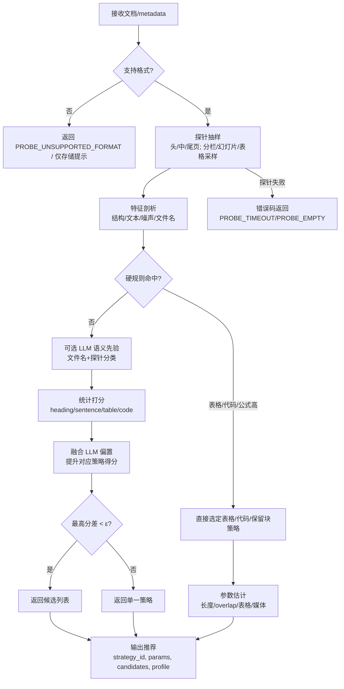

# 文档切片方式智能推荐引擎

## 1. 设计原则
- **配置化与安全**：阈值、权重、LLM 开关、资源/页数/时长限制均可 YAML/环境变量热更；延续转换引擎的配额/鉴权/错误码体系。
- **插件化/可扩展**：策略打分器、探针器、切片器解耦成可插拔组件，便于新增策略或替换 LLM 先验实现。
- **资源优先级与异步**：轻量探针/推荐走高优先队列，切片执行可独立队列；支持链式 Celery，避免阻塞 API。
- **规则优先、统计兜底、LLM 轻量辅助**：先硬规则（表格/代码/公式等），再统计打分，必要时才调小模型做歧义判别，控制成本。
- **块级路由与互斥**：解析阶段统一产出 `block_type`，切片阶段按块路由策略，文本滑窗跳过表格/代码/公式/图片，避免策略冲突。
- **幂等与回退**：同一 `doc_id+trace_id` 重入直接复用结果；探针/切片失败回退保守滑窗并打标 `fallback=true`。
- **可观测性**：对齐转换引擎的结构化日志/Tracing/Prometheus 指标，新增块级路由命中率、LLM 调用率、误切片率。
- **数据最小化与合规**：探针仅抽样必要文本；LLM 仅传递最小上下文，支持脱敏与超时/令牌上限控制。

## 2. 概述
- 面对超大文档（数十至数百页）时，需在不加载全文的情况下快速洞察结构特征（标题层级、列表/表格密度、长段落/代码等），为后续切片与向量化选择合适策略。
- 利用“小探针”抽样获取代表性片段，结合轻量规则/特征统计完成策略推荐。handle_batch` 做格式规范化（如 DOCX/HTML/PDF→PDF/文本），为切片与向量化做准备。
- 设计兼顾实时性（<1s 出推荐）、可观测性（探针命中率、推荐命中率）、可扩展性（支持多格式、多策略）。

## 3. 关键概念
- **探针（probe）**：对源文档进行局部抽样的最小单元（按页、段、文本框、表格片段等）。
- **特征剖析（profiling）**：对探针内容提取结构/统计/噪声特征，生成内容画像。
- **策略推荐（strategy recommendation）**：基于画像选择切片策略（含自定义分隔符命中优先），如 `heading_block + length_split`、`sentence_split + sliding_window`、`table_batch`、`custom_delimiter_split`等。


## 4. 总体流程
1) **探针抽样**：
   - 分页型（PDF/DOCX）：取头/中/尾各 1~2 页；检测分栏后按列切出探针。
   - 幻灯片（PPTX）：取头/中/尾页的文本框；保留页号。
   - HTML/Markdown：取前后 3 个标题块；弱结构时按段落采样。
   - 表格/日志：抽样若干行/块，保留列名/时间戳。
2) **特征剖析**：
  - 结构：heading 密度、列表密度、表格/代码块存在性、页眉页脚噪声、目录模式、数学公式块存在性。
  - 文本：段落均长/P90、符号/数字占比、重复模式、OCR 置信度（如有）、`math_density`（公式块/行占比，含 LaTeX/MathML/`$$...$$`/`\(\)` 检测）。
  - 版面：页/列分布、文本框数量、页码位置、图片占比。
3) **策略推荐**：
  - 结构化：`heading_block + length_split(200~400字)`。
  - 弱结构长段：`sentence_split + sliding_window(overlap=10~20%)`。
  - 表格密集：`table_batch + paragraph_split`。
  - 代码/日志：`code/log_block + no_overlap`。
  - 幻灯片：`slide_block + textbox_merge`。
    - 自定义分隔符命中：`custom_delimiter_split + length_split`（用户/正则分隔符，命中阈值即选用，未命中回退基线）。
4) **当前限制与归属**：图片不做文本切片；表格、图片、公式会被定位并归属到最近的文本片段（或专属块），以避免语义丢失；表格后续使用专门的表格切片方式，不在本算法内。音视频如启用切片，缺省采用按场景切分（备选按时长切分）。

## 5. 引擎工作流程图



## 6. 编排设计
- **任务链路（Chain）**：
  1. `probe.extract_signals`：对源文件做探针抽样与特征剖析，输出 `profile`。
  2. `probe.recommend_strategy`：基于 `profile` 返回 `strategy_id` 与参数（target_length/overlap/preserve_tables 等）。

- **队列与优先级**：探针/推荐步骤轻量，统一使用高优先级队列；
- **Celery 编排示例（独立服务封装）**：
  - 目标：将转换→探针→推荐封装为一个 Celery chain，供编排或API调用。
  - 依赖：`conversion.handle_batch`（返回规范化文档或页流）、`probe.extract_signals`、`probe.recommend_strategy`。
  - 简化示例：
```python
from celery import Celery, chain

app = Celery("probe_recommend", broker="redis://localhost:6379/0", backend="redis://localhost:6379/1")

@app.task(name="conversion.handle_batch")
def convert_task(doc_id, src_path, fmt):
    # 调用现有文档转换引擎，返回标准化文档句柄或页流
    return conversion.handle_batch(doc_id=doc_id, src_path=src_path, fmt=fmt)

@app.task(name="probe.extract_signals")
def probe_task(doc_handle):
    # 从标准化文档抽样探针，输出 profile 和探针样本
    return probe.extract_signals(doc_handle)

@app.task(name="probe.recommend_strategy")
def recommend_task(profile):
    return probe.recommend_strategy(profile)

def submit_job(doc_id, src_path, fmt):
    flow = chain(
        convert_task.s(doc_id, src_path, fmt),
        probe_task.s(),
        recommend_task.s(),
    )
    async_result = flow.apply_async()
    return async_result.id

# 取结果
# result = app.AsyncResult(job_id).get(timeout=30)
```
  - 编排逻辑：
    1) 入队时仅传 `doc_id/src_path/fmt`；
    2) `convert_task` 产出标准化文档句柄；
    3) `probe_task` 产出 `profile`（含探针样本）；
    4) `recommend_task` 返回推荐策略和参数；
    5) 异常在各 task 内捕获并返回错误码，chain 将错误向上抛出供调用方处理。

## 7. 智能自适应切片设计（推荐 + 切片执行）
- **目标**：在已有推荐能力基础上自动完成切片执行，适配不同文档类型与场景；保持幂等、可观测，可在 Celery 中独立服务化。
- **编排链路（Celery chain）**：转换 → 探针 → 推荐 → 切片执行 → 结果落盘/回传。

```python
from celery import Celery, chain

app = Celery("adaptive_slice", broker="redis://localhost:6379/0", backend="redis://localhost:6379/1")

@app.task(name="conversion.handle_batch")
def convert_task(doc_id, src_path, fmt):
    return conversion.handle_batch(doc_id=doc_id, src_path=src_path, fmt=fmt)

@app.task(name="probe.extract_signals")
def probe_task(doc_handle):
    return probe.extract_signals(doc_handle)

@app.task(name="probe.recommend_strategy")
def recommend_task(profile):
    return probe.recommend_strategy(profile)

@app.task(name="slicer.apply_strategy")
def slice_task(doc_handle, recommendation):
    # recommendation = {strategy_id, params, profile}
    return slicer.apply(doc_handle, recommendation)

def submit_adaptive_slice(doc_id, src_path, fmt):
    flow = chain(
        convert_task.s(doc_id, src_path, fmt),      # 标准化文档
        probe_task.s(),                             # 探针 + 画像
        recommend_task.s(),                         # 策略 + 参数
        slice_task.s(),                             # 按推荐策略切片
    )
    return flow.apply_async().id

# 查询
# result = app.AsyncResult(job_id).get(timeout=120)
```

- **输入/输出契约**：
  - 入参：`doc_id, src_path, fmt`；可加 `priority`、`trace_id`。
  - 输出：`{chunks: [...], meta: {strategy_id, params, profile, doc_id}}`，失败时 `{error_code, message}`。
- **切片执行要点**：
  - 采用推荐的 `strategy_id` 和 `params` 驱动 `slicer.apply`；表格/媒体策略需保留行列与锚点元数据。
  - 支持幂等：同一 `doc_id` + `trace_id` 重复请求直接返回已完成结果。
  - 观测：记录转换/探针/推荐/切片各阶段耗时、错误码、chunk 数量与平均长度。
  - 限流与超时：转换和切片阶段单独超时；探针/推荐保持低延迟。
- **可选扩展**：
  - LLM 先验开启时，可将 `llm_prior` 一并存储，供离线评估。
  - 支持策略回退：切片失败时回退 `sentence_split_sliding` 通用方案。

## 8. 分段智能自适应切片（章节/内容级混合策略）
- **核心思想**：文档级推荐给出“基线策略+参数”，但执行阶段可按章节/块类型动态择优：同一文档不同片段可以使用不同策略（如正文按标题块切，表格按表格批切，代码块按代码策略，长段落按滑窗）。
- **判别与路由**：
  - 基于转换后的结构节点（标题、段落、表格、代码块、图片/公式块）和探针画像特征，做块级类型判别。
  - 块级优先级：表格 > 代码/日志 > 公式/图片保留 > 幻灯片文本框 > 基线策略（heading_block / sentence_sliding）。
  - 可选 LLM 细粒度判别：对歧义块（如嵌套列表/伪代码）调用轻量 LLM 分类，再路由策略。
- **执行流程（在切片执行器内部）**：
```python
def adaptive_slice(doc_handle, recommendation, profile):
    base_strategy = recommendation["strategy_id"]
    base_params = recommendation["params"]
    chunks = []
    for block in iter_blocks(doc_handle):
        block_type = detect_block_type(block)  # table/code/math/image/slide/paragraph
        strategy, params = select_strategy(block_type, base_strategy, base_params)
        chunks.extend(apply_strategy(block, strategy, params))
    return chunks

def select_strategy(block_type, base_strategy, base_params):
    if block_type == "table":
        return "table_batch", {"preserve_tables": True}
    if block_type in ("code", "log"):
        return "code_log_block", {"no_overlap": True}
    if block_type in ("math", "image"):
        return "keep_block_only", {"keep_block": True}
    if block_type == "slide_text":
        return "slide_block_textbox_merge", {}
    # 默认回落基线策略
    return base_strategy, base_params
```
- **参数继承与微调**：
  - 默认继承推荐参数；对表格/代码/图片块使用各自安全参数（如 `no_overlap=True`，保留表头）。
  - 对极长段落可局部调高 `overlap_ratio`，对噪声页眉降低重叠。
- **输出与元数据**：
  - 每个 chunk 记录 `strategy_id`、`block_type`、`anchor_id/page_index/column_index`，便于检索与审计。
  - 统计混合策略分布（各策略生成的 chunk 数/比例），支持灰度对比。
- **可观测性与回退**：
  - 暴露块级路由命中率、LLM 调用次数与耗时；异常块回退基线策略并标记 `fallback=true`。
  - 若切片阶段出错，可整体回退“纯基线策略”重试一遍。
- **补充优化（避免冲突、提升质量）**：
  - 检测一致性：解析阶段统一输出 `block_type`、页/列坐标、锚点 ID，切片阶段只按此路由，避免策略与识别不一致。
  - 互斥与跳过：文本滑窗对 block_type ∈ {table, code, math, image} 直接跳过；表格/代码策略不落在 paragraph/list；math/image 仅走 `keep_block_only`，不再进入 length_split。
  - 参数安全阈值：表格块强制 `preserve_tables=True`，代码/日志强制 `no_overlap=True`，图片/公式强制 `keep_block=True`；对超宽表格可拆行，对超长段落自动抬高重叠。
  - LLM 介入最小化：仅在歧义块调用 LLM，小模型/低 token；无法判别时回退基线并打标 `fallback=true`。
  - 质量监控：跟踪块级误切片率（表格误判为正文、代码误判为正文）、冲突次数、回退率；超过阈值触发告警并记录样本用于规则/模型迭代。

## 9. 推荐结果输出示例
```json
{
  "task_id": "probe-and-recommend-123",
  "profile": {
    "heading_ratio": 0.42,
    "list_ratio": 0.18,
    "table_ratio": 0.05,
    "code_ratio": 0.0,
    "p90_para_len": 220,
    "samples": ["H1: 概述...", "段落...", "列表..."],
    "limits": {"media_slice_supported": false}
  },
  "recommendation": {
    "strategy_id": "heading_block_length_split",
    "params": {
      "target_length": 220,
      "overlap_ratio": 0.15,
      "preserve_tables": true
    },
    "candidates": [
      {"strategy_id": "heading_block_length_split", "score": 0.71},
      {"strategy_id": "sentence_split_sliding", "score": 0.66}
    ],
    "notes": "当前不执行转换与切片，媒体类不支持切片"
  }
}
```

## 10. 策略推荐逻辑
- `custom.enable && delimiter_hits>=min_segments` → `custom_delimiter_split (+ length_split)`
- `has_headings || list_density>阈值` → `heading_block + length_split(200~400字)`
- `code_density>阈值 || log_pattern` → `code/log_block + no_overlap`
- `table_density>阈值` → `table_batch + paragraph_split`
- `else` → `sentence_split + sliding_window(overlap=15%)`

**切片策略定义表**
| 策略 ID | 与当前RAG产品切片策略的映射关系<br>切片代码→切片策略名称 | 说明 | 适用特征 | 关键参数 |
| --- | --- | --- | --- | --- |
| `heading_block_length_split` | `1 ->`<br>`标题块切分` | 按标题块切片，块内再按长度拆分 | 高标题/列表密度，结构化报告、规程 | `target_length`，`overlap_ratio` |
| `sentence_split_sliding` | `2 ->`<br>`句级滑窗` | 句级切分+滑窗 | 弱结构长段文本，叙述类 | `target_length`（句合并阈值），`overlap_ratio` |
| `custom_delimiter_split` | `9 ->`<br>`自定义分隔符切片` | 按用户/正则分隔符切段，超长再按长度拆分 | QA/聊天/脚本/半结构化日志，存在显式分隔符 | `delimiters[]`，`min_segment_len`，`max_segment_len`，`overlap_ratio` |
| `table_batch` | `3 ->`<br>`表格批切` | 表格整块/分行切分 | 表格占比高、宽表 | `preserve_tables`，列数阈值，宽表拆行开关 |
| `code_log_block` | `4 ->`<br>`代码/日志块` | 代码/日志块整块切分 | 代码密度高、日志模式 | `no_overlap`，块大小上限 |
| `slide_block_textbox_merge` | `5 ->`<br>`幻灯片文本框合并` | 幻灯片文本框合并为页块 | PPTX/幻灯片 | `merge_textboxes=true`，按页/文本框顺序 |
| `keep_block_only` | `6 ->`<br>`保留块（图片/公式）` | 仅标记保留块（公式/图片） | 图片/公式，不切片 | `keep_block=true`（不生成文本切片） |
| `av_scene_cut` | `7 ->`<br>`场景切分（音视频）` | 按场景/镜头切分音视频 | 音视频，默认优先 | 场景检测阈值（如视/听相似度 0.35~0.45）、最小片段时长（≥5s） |
| `av_duration_cut` | `8 ->`<br>`时长切分（音视频）` | 按固定时长切分音视频 | 音视频备选 | 片长阈值（默认 30s，可设 60s），可叠加轻微重叠（5%） |

**不同文档类型的缺省策略（可被推荐覆盖）**
| 文档类型 | 常见格式 | 缺省策略 | 备注 |
| --- | --- | --- | --- |
| 结构化报告/规程/论文 | docx, pdf, odt | `heading_block_length_split` | 高标题/列表密度，200~400 字分块 |
| 弱结构长段（纪实、小说） | txt, docx, pdf, rtf | `sentence_split_sliding` | 句合并+滑窗，overlap 10~20% |
| 聊天/问答/脚本/分隔符日志 | txt, md, log | `custom_delimiter_split` | 命中分隔符优先；未命中回退句级滑窗 |
| 表格密集（财报、表单） | xlsx, csv, docx, pdf, ods | `table_batch` | 表格专用切片，文本块仍用标题/句切分 |
| 代码/日志 | txt, log, md | `code_log_block` | 整块切分，无重叠 |
| 公式密集（教材、试卷） | docx, pdf, odt | `heading_block_length_split` + `keep_block` | 公式整块保留，不拆分；文本按标题切分 |
| 幻灯片 | ppt, pptx, pdf, odp | `slide_block_textbox_merge` | 每页合并文本框；图片/公式随块归属 |
| 图片 | png, jpeg, jpg | `keep_block_only` | 不切片，仅保留块或提示存储 |
| 音视频 | mp4, mov, wav, mp3 | `av_scene_cut` | 缺省按场景切分；备选 `av_duration_cut` 按时长切分 |

## 11. 核心算法
- **探针抽样**（O(k) 页/块）：
  - PDF/DOCX：`k<=6`，取头/中/尾页；若检测到分栏则切分列；若页数未知，先流式读取前若干页。
  - PPTX：取头/中/尾页文本框；记录 `slide_index` 与 `textbox_index`。
  - HTML/MD：按标题块抽样，若缺少标题则按段落长度分位抽样。
  - 表格/日志：保留表头 + 随机/间隔抽样若干行；记录行号/时间戳范围。
- **特征剖析**（规则+统计，O(n) 探针文本长度）：
  - 结构密度：`heading_ratio`、`list_ratio`、`table_ratio`、`code_ratio`、`math_ratio`、`slide_textbox_cnt`。
  - 文本统计：段落长度均值/中位/`p90`，`digit_symbol_ratio`，重复度（shingle 重复计数），OCR 置信度均值/方差（如有）。
  - 版面噪声：页眉页脚相似度（跨页最长公共子序列/词频 Jaccard），页码位置，图片占比 `image_ratio`。
  - 文件名/路径信号：扩展名、文件名关键词（如 report/log/slide/table/code/qa/exam），用于先验判断文档类型。
- **策略打分**（rule-first，score-second）：
  - 先匹配高优先级规则（如 `table_ratio>t1` → 表格策略；`code_ratio>t2` → 代码/日志策略；`math_ratio>m1` → 需保留公式块整段切分；`custom.enable && delimiter_hits>=min_segments` → 自定义分隔符策略）。表格的细粒度切片由表格策略单独处理；图片、公式标记归属到所在块，不单独切分。
  - 对剩余策略计算分数：
    - `heading_block` 得分 ~ `heading_ratio + list_ratio`。
    - `sentence_split_sliding` 得分 ~ `1 - heading_ratio`，惩罚长段 `p90`。
    - `table_batch` 得分 ~ `table_ratio`。
    - `custom_delimiter_split`：不参与常规打分，命中阈值即选用；可记录 `delimiter_hits` 供观测。
  - 选最高分策略，若分差 < ε，可返回候选列表供前端切换。
- **参数估计**：
  - 目标长度：`min(max(p50段落长度, 150), 400)`；弱结构时用句长均值。
  - 重叠：`overlap = 0.15` 默认；若页眉噪声高，降低重叠；若信息稀疏，可升至 `0.2`。
  - 表格策略：若列数>12 或宽表，拆行块；否则整表为块。
  - 自定义分隔符：命中后默认目标长度继承基线（如 200~400），但先按分隔符切段，再对超长段做二次拆分；未命中阈值时回退基线并记录 `fallback=true`。
- **输出约束**：
  - 当前仅输出策略与参数；不执行转换/切片。
  - 媒体类（图片/音视频）返回“仅存储，不切片/不转换”提示；公式/图片块标记为保留整块，与所在文本片段一起落在同一切片，避免语义丢失。表格使用表格专用切片方式，归属当前片段并保持行列结构。

**归属规则示例（表格/图片/公式）**
- 锚点选择：优先最近的上游标题块（H1-H3），否则最近段落；若在同页/同列范围内有多个候选，按距离和阅读顺序（自上而下、左到右）取最近。
- 分栏/多列：在列内找最近标题/段落；跨列时再考虑全页最近标题。
- 幻灯片：归属同页的主文本框；若无文本框则单独成片段并带 `slide_index` 元数据。
- 表格：归属所在页面/列最近标题或段落，标记 `table_block=true`；具体切片由表格策略执行。
- 图片/公式：整块保留，归属最近标题/段落，标记 `keep_block=true`，不做拆分；若缺少文本邻居则单独成片段并提示“语境缺失”。

**归属元数据字段示例**
| 字段名 | 含义 | 示例 |
| --- | --- | --- |
| `anchor_id` | 关联的标题/段落 ID | `h1_003` / `para_210` |
| `anchor_level` | 标题层级或段落 | `H2` / `paragraph` |
| `distance` | 与锚点的距离（行/字符/版面坐标差） | `12 lines` 或 `bbox_diff=(dx,dy)` |
| `column_index` | 所在列（分栏/表格内） | `0`/`1` |
| `page_index` | 页号/幻灯片号 | `5` |
| `table_block` | 是否表格块 | `true/false` |
| `keep_block` | 是否保持整块（图片/公式） | `true/false` |
| `context_missing` | 是否缺少文本邻居 | `true/false` |
| `slide_index` | 幻灯片索引（PPTX） | `7` |

**默认取值规则（示例）**
- `anchor_id/anchor_level`: 最近标题或段落；若无则 `null`，并置 `context_missing=true`。
- `distance`: 无锚点时置 `null`；有锚点时以行差/坐标差填充。
- `column_index/page_index/slide_index`: 解析得到，缺失则置 `-1` 或 `null`。
- `table_block/keep_block`: 按块类型自动布尔；图片/公式 → `keep_block=true`，表格 → `table_block=true`。
- `context_missing`: 当无可用锚点或相距超阈值时置 `true`。
- **降级与回退**：
  - 探针失败：回退固定页窗（前 3 页）+ 通用 `sentence_split_sliding`。
  - 特征缺失：使用默认参数（200 字，15% overlap）。

### 11.1 打分公式
设特征：$h=heading\_ratio,\ l=list\_ratio,\ t=table\_ratio,\ c=code\_ratio,\ p=p90\_para\_len$，权重超参：$w_h,w_l,w_t,w_c,w_p$，则：

$$S_{heading\_block}=w_h\cdot h + w_l\cdot l - w_p\cdot \max\left(0,\frac{p-300}{300}\right)$$

$$S_{sentence\_sliding}=1 - h - 0.3\cdot l - 0.2\cdot t - 0.2\cdot c + w_p\cdot \min\left(1,\frac{p}{400}\right)$$

$$S_{table\_batch}=w_t\cdot t$$

$$S_{code/log}=w_c\cdot c$$

> 自定义分隔符策略不走打分公式，而是走“命中阈值即硬选”的 gating 逻辑，未命中时回退常规策略。

- 初始权重建议：$w_h=0.6,\ w_l=0.4,\ w_t=0.8,\ w_c=0.8,\ w_p=0.3$。
- 最终策略：先应用硬规则（如 $t>t_1$、$c>c_1$），否则选择 $\arg\max S$；若前两高分差 < $\epsilon$，返回候选列表供人工切换。

**打分参数表（含建议阈值/初始值）**
| 名称 | 符号/字段 | 类型/范围 | 含义 | 备注/默认 |
| --- | --- | --- | --- | --- |
| 标题密度 | $h$ (`heading_ratio`) | [0,1] | 探针内标题字符/行占比 | 来自特征剖析 |
| 列表密度 | $l$ (`list_ratio`) | [0,1] | 探针内列表占比 | |
| 表格密度 | $t$ (`table_ratio`) | [0,1] | 探针内表格占比 | 硬规则阈值 `t1` |
| 代码密度 | $c$ (`code_ratio`) | [0,1] | 探针内代码/日志占比 | 硬规则阈值 `t2` |
| 段落长度 P90 | $p$ (`p90_para_len`) | 正数，字数 | 长段惩罚/加权 | 用于窗口长度估计 |
| 公式密度 | $m$ (`math_ratio`/`math_density`) | [0,1] | 公式/数学块占比，含 LaTeX/MathML/$$/\(\) | 硬规则阈值 `m1`，高时保留整块 |
| 图片占比 | (`image_ratio`) | [0,1] | 图片区域占比 | 仅提示“不切片”，不参与打分 |
| 标题权重 | $w_h$ | 正数 | 标题对 `heading_block` 得分贡献 | 默认 0.6 |
| 列表权重 | $w_l$ | 正数 | 列表对 `heading_block` 得分贡献 | 默认 0.4 |
| 表格权重 | $w_t$ | 正数 | 表格对 `table_batch` 得分贡献 | 默认 0.8 |
| 代码权重 | $w_c$ | 正数 | 代码对 `code/log` 得分贡献 | 默认 0.8 |
| 长段惩罚权重 | $w_p$ | 正数 | 对超长段落的惩罚/奖励 | 默认 0.3 |
| 表格硬阈值 | `t1` | [0,1] | 触发表格策略的阈值 | 建议 0.15~0.2 |
| 代码硬阈值 | `t2` | [0,1] | 触发代码/日志策略阈值 | 建议 0.08~0.12 |
| 公式硬阈值 | `m1` | [0,1] | 触发公式整块保留阈值 | 建议 0.05~0.1 |
| 候选差值阈 | $\epsilon$ | 正数 | 前两名分差阈值，用于返回候选列表 | 建议 0.05 |
| 目标长度估计 | `target_length` | 150~400 字 | 由 `p50` 或句长估计 | 受策略影响 |
| 重叠比例 | `overlap_ratio` | [0,0.3] | 滑窗重叠控制 | 默认 0.15 |

**默认参数表（可配置）**
| 配置键 | 默认值 | 适用范围 | 说明 |
| --- | --- | --- | --- |
| `weights.w_h` | 0.6 | 文本 | 标题得分权重 |
| `weights.w_l` | 0.4 | 文本 | 列表得分权重 |
| `weights.w_t` | 0.8 | 文本/表格 | 表格得分权重 |
| `weights.w_c` | 0.8 | 文本/代码 | 代码/日志得分权重 |
| `weights.w_p` | 0.3 | 文本 | 长段惩罚/奖励权重 |
| `thresholds.t1_table` | 0.18 | 文本/表格 | 表格硬阈值（表格策略触发） |
| `thresholds.t2_code` | 0.10 | 文本/代码 | 代码/日志硬阈值 |
| `thresholds.m1_math` | 0.08 | 文本/公式 | 公式整块保留硬阈值 |
| `thresholds.epsilon` | 0.05 | 文本 | 候选分差阈值（返回候选列表） |
| `target_length.default` | 220 | 文本 | 标题/句分块长度（字） |
| `overlap_ratio.default` | 0.15 | 文本 | 滑窗重叠比例 |
| `av.scene.sim_threshold` | 0.4 | 音视频 | 场景相似度阈值（视/听融合） |
| `av.scene.min_duration_sec` | 5 | 音视频 | 最小片段时长（秒） |
| `av.duration.cut_seconds` | 30 | 音视频 | 固定时长切分（秒），可改 60 |
| `av.duration.overlap_ratio` | 0.05 | 音视频 | 时长切分的重叠比例 |
| `llm.enable_prior` | false | 文本/通用 | 是否启用大模型语义先验加权 |
| `llm.max_tokens` | 256 | 文本/通用 | LLM 调用 token 上限（控制成本） |
| `custom.enable` | false | 文本 | 是否开启自定义分隔符策略 |
| `custom.delimiters` | [] | 文本 | 文本/正则分隔符列表 |
| `custom.min_segments` | 5 | 文本 | 命中阈值，低于则回退基线 |
| `custom.min_segment_len` | 30 | 文本 | 最小段长，过短丢弃或合并 |
| `custom.max_segment_len` | 800 | 文本 | 最大段长，超过则二次长度拆分 |

**YAML 配置示例（可覆盖默认）**
```yaml
weights:
  w_h: 0.6
  w_l: 0.4
  w_t: 0.8
  w_c: 0.8
  w_p: 0.3

thresholds:
  t1_table: 0.18
  t2_code: 0.10
  m1_math: 0.08
  epsilon: 0.05

text:
  target_length: 220     # 150~400 区间内可调
  overlap_ratio: 0.15    # 0~0.3

audio_video:
  scene:
    sim_threshold: 0.4   # 可调 0.35~0.45
    min_duration_sec: 5
  duration:
    cut_seconds: 30      # 可调 30/60
    overlap_ratio: 0.05

llm:
  enable_prior: false    # 生产可默认关闭，需时可打开
  max_tokens: 256
```

**权重/阈值微调建议**
- 文档极弱结构（低 h、低 l）：提高 $w_p$ 至 0.4，降低 $w_h$ 至 0.5，鼓励滑窗。
- 法规/报告（高 h，高 l）：提高 $w_h$ 至 0.7，$w_l$ 至 0.5，确保按标题块切分。
- 表格型（高 t）：降低 $\epsilon$ 至 0.03，便于保留表格策略优先；必要时提高 `t1` 到 0.2 防止偶发表格误触发。
- 代码/日志（高 c）：提高 $w_c$ 至 0.9，$w_p$ 降到 0.2 以减少长段惩罚的影响。
- 公式密集（高 m）：提高 `m1` 精度，触发“整块保留”并在参数中设置 `preserve_math_block=true`。

### 11.2 伪代码
```python
def recommend(file, k=6, emit_candidates=False):
  try:
    probes = sample_probes(file, k=k)              # 头/中/尾 + 分栏切分
    if not probes:
      return {
        "error_code": "PROBE_EMPTY",
        "message": "未获取到有效探针",
        "notes": "仅推荐，不执行转换/切片"
      }

    features = profile(probes)                     # 结构/文本/噪声特征
    delimiter_hits = detect_delimiters(
      probes,
      delimiters=request.custom.delimiters if request.custom.enable else []
    )
  except ProbeError as e:
    return {
      "error_code": e.code,
      "message": str(e),
      "notes": "仅推荐，不执行转换/切片"
    }

  # 规则优先
    if request.custom.enable and delimiter_hits >= request.custom.min_segments:
      strategy = "custom_delimiter_split"
      scores = {"custom_delimiter_split": 1.0, "delimiter_hits": delimiter_hits}
    elif features.table_ratio > t1:
      strategy = "table_batch"
    elif features.code_ratio > t2:
      strategy = "code_log_block"
    else:
      # 可选：结合大模型语义先验（文件名+探针文本分类）
      llm_prior = classify_with_llm(filename=file.name, samples=probes[:2])  # 返回 doc_type 概率分布

      # 基础打分
      s_heading = w_h*features.heading_ratio + w_l*features.list_ratio - w_p*max(0, (features.p90_len-300)/300)
      s_sentence = 1 - features.heading_ratio - 0.3*features.list_ratio - 0.2*features.table_ratio - 0.2*features.code_ratio + w_p*min(1, features.p90_len/400)
      s_table = w_t*features.table_ratio
      s_code = w_c*features.code_ratio

      # 语义先验加权（示例：若 LLM 判断为“slide/report/table”则提升对应策略分）
      s_heading += 0.1 * llm_prior.get("report", 0)
      s_sentence += 0.05 * llm_prior.get("narrative", 0)
      s_table   += 0.15 * llm_prior.get("table", 0)
      s_code    += 0.1 * llm_prior.get("code", 0)

      scores = {
        "heading_block_length_split": s_heading,
        "sentence_split_sliding": s_sentence,
        "table_batch": s_table,
        "code_log_block": s_code,
      }
      strategy = argmax(scores)

    params = estimate_params(features, strategy, custom=request.custom)   # 目标长度/overlap/拆表等

    return {
        "strategy_id": strategy,
        "params": params,
        "candidates": scores if emit_candidates else None,
        "delimiter_hits": delimiter_hits,
        "profile": features,
        "notes": "仅推荐，不执行转换/切片"
    }
```

  ### 11.3 大模型语义先验融合（可选）
  - **触发条件**：当文件名包含明确语义关键词（report/log/slide/table/code/qa/exam）或探针样本存在不确定性时启用；生产可默认关闭，按需打开。
  - **输入**：文件名/路径、前 1~2 个探针文本；控制 token 上限避免成本过高。
  - **输出**：文档类型概率分布 `llm_prior`（如 report/narrative/table/code/slide），可附示例段落的推理标签。
  - **融合方式**：在基础打分后加权（见 11.2 伪代码），对匹配的策略分数增加小幅偏置（示例 0.05~0.15）。
  - **安全与开销**：限制 `max_tokens`，设置超时；无法获取先验时回退纯规则/统计打分。
  - **提示词示例（用于 LLM 决策）**：

```text
你是文档切片策略推荐助手。根据给定的文件名和探针文本，判断最可能的文档类型，并输出对应的切片策略偏好。

要求：
1) 文档类型在 {report, narrative, table, code, slide} 中选择，可多类别给概率。
2) 给出每个类别的概率（0~1，总和≈1）。
3) 建议切片策略（从下列映射中选）：
   1 -> 标题块切分
   2 -> 句级滑窗
   3 -> 表格批切
   4 -> 代码/日志块
   5 -> 幻灯片文本框合并
   6 -> 保留块（图片/公式）
   7 -> 场景切分（音视频）
   8 -> 时长切分（音视频）
4) 输出 JSON：{
     "doc_type_probs": {"report":0.xx,"narrative":0.xx,"table":0.xx,"code":0.xx,"slide":0.xx},
     "suggested_strategy_code": <1-8>,
     "rationale": "简要理由（文件名/探针信号）"
   }
5) 如无把握，仍需给出保守概率分布，避免空输出。

输入示例：
filename: Annual_Report_2024.pdf
probe_samples:
- "目录\n1. 公司概况..."
- "第二章 财务报表..."
```

### 11.4 探针失败返回格式与错误码约定
- **返回格式**：
```json
{
  "task_id": "probe-and-recommend-123",
  "error_code": "PROBE_TIMEOUT",
  "message": "探针超时：超过 800ms",
  "notes": "仅推荐，不执行转换/切片"
}
```
- **错误码示例**：
  - `PROBE_TIMEOUT`：探针或特征剖析超时。
  - `PROBE_EMPTY`：未采样到有效文本/块。
  - `PROBE_UNSUPPORTED_FORMAT`：格式不支持或媒体类不切片。
  - `PROBE_SIZE_LIMIT`：文件/页数超限被拒绝。
  - `PROFILE_EXTRACTION_ERROR`：特征解析失败（如 OCR/解析异常）。
- **处理建议**：
  - 对 `PROBE_TIMEOUT` 可提示“重试”或降级固定规则（如通用滑窗）。
  - 对媒体类 `PROBE_UNSUPPORTED_FORMAT` 直接提示“仅存储，不切片”。
  - 对 `PROBE_SIZE_LIMIT` 返回上限信息，建议分批或压缩后重试。

## 12. 元数据与可观测性
- **保留元数据**：doc_id、source_format、page/slide、section_path、strategy_id、probe_sample_info、chunk_rule。
- **指标**：
  - 探针耗时、探针覆盖率（采样页/总页估计）、策略推荐耗时。
  - 推荐命中率（人工选择 vs 默认）、重跑率（用户切换策略）。
  - （当前不涉及转换/切片）
- **日志/调试**：记录探针样本摘要、推荐原因（rule hit）、评分明细（含特征与权重），不含原文全文。

## 13. 性能与降级
- 抽样优先：仅解析头/中/尾窗口，必要时分页流式；解析失败时回退固定长度切片。
- 资源控制：限制单任务文件大小/页数；对超大文档分批转换（page ranges）。
- 失败回退：conversion 失败时返回错误码并携带 source 定位；切片失败回退通用滑窗策略。

