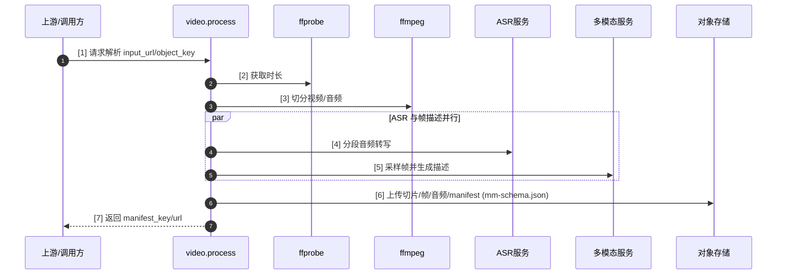
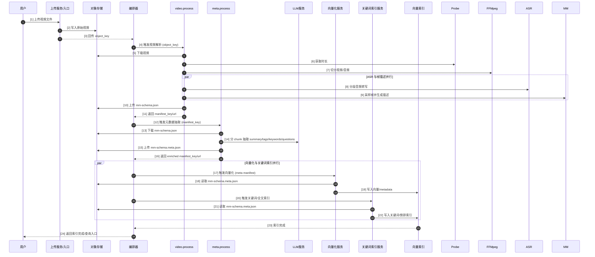

# 视频解析详细设计

## 1. 概述
  - 视频解析模块的定位：具备通过整合和编排，实现独立的视频解析服务能力，可解析出画面、音频、字幕的相关内容信息，并转换为文本内容，并可分段处理上述内容，并在时间上对齐一致。生成的所有元数据信息存储为文档对象的描述文件mm-schema.json 中，附带的实体文件一同推送到对象存储中保存，供下游任务使用。
- 可单独部署或被编排器调用，作为后续向量化/索引的前置决策与数据准备。

### 1.1 设计原则
- 规则优先、统计兜底、LLM 轻量辅助：能用时长/场景切分、ASR、关键帧描述解决的先不用大模型，LLM 仅做结构化抽取。
- 幂等与保护源：生成的新 manifest 追加 `.meta.json` 不覆盖原文件；任务可重入复用已有输出。
- 可观测与可回退：阶段耗时/命中率/错误码完整打点；ASR/LLM 失败回退关键帧文本；分段失败回退整段。
- 成本与并发可控：限制 `max_chunks`、`frame_caption_max`、LLM `max_tokens`/超时；ASR/多模态/LLM 并发可配置。
- 数据最小化与合规：抽取阶段仅传递必要文本/帧描述，避免传全视频内容；日志不落原文。

### 1.2 范围与边界
- 支持：视频下载、时长探测、音视频分段、帧采样、ASR、关键帧描述、LLM 元数据抽取与聚合。
- 不做：视频转码/增强；不强制场景切分（可选）；不覆盖原始 manifest；不直接向量化，仅产出可供索引/向量化的 enriched manifest。
- 资源约束：超长视频可配置最大总时长/最大 chunk 数，超限直接失败并返回错误码。

## 2. 交互时序

### 2.1 视频解析主流程


**步骤与核心参数说明**
- [1] 请求解析：入参 `input_url` 或 `object_key`，可选 `segment_seconds`（默认 30s）、`scene_cut`（bool）、`scene_threshold`（默认 0.35）、`scene_min_duration_sec`（默认 5s）、`frame_sample_fps`、`frame_prompt`。
- [2] 获取时长：`ffprobe` 探测总时长，必要时可设置探测超时（当前实现未暴露为参数）。
- [3] 切分视频/音频：优先场景切分（启用 `scene_cut` 时；阈值 `scene_threshold`，最小时长 `scene_min_duration_sec`），无切点则回退固定时长 `segment_seconds`。
- [4] 分段音频转写（串行调用，多段）：未暴露并发/超时参数，按片段顺序调用 ASR 服务。
- [5] 帧采样与描述：按 `frame_sample_fps` 抽帧，最多 `frame_caption_max` 条描述（由配置限制），使用 `frame_prompt`。
- [6] 上传解析产物：上传切片、音频、帧与 `mm-schema.json`，对象键前缀 `mm/video/{task_id}/...`。
- [7] 返回结果：`{task_id, bucket, manifest_key, manifest_url, prefix, doc}`；`duration/total_chunks/language` 可在 `doc` 内查看。

### 2.2 全链路编排


**步骤与核心参数说明**
- [1]-[3] 上传与入库：上传入口接收文件，写入对象存储；可配置 `max_size`/`max_duration` 超限直接拒绝，返回 `object_key`。
- [4] 触发视频解析：编排器将 `object_key` 传给 `video.process`，可携带 `segment_seconds`、`scene_cut`、`scene_threshold`、`scene_min_duration_sec`、`frame_sample_fps`、`frame_prompt`。
- [5]-[7] 下载与探测/切分：下载视频；`ffprobe` 时长探测；优先场景切分（启用时），无切点回退固定时长分段。
- [8]-[9] ASR 与帧描述：实现中按片段顺序调用 ASR，并按采样帧调用多模态描述（无并发/超时参数透传）。
- [10]-[11] 上传与返回：上传 `mm-schema.json` 及切片/帧/音频；返回 `manifest_key/url`、`doc`。
- [12]-[16] 元数据抽取：
  - 下载 manifest；补全文本（full_text/segments/keyframes）。
  - LLM 抽取：使用配置的模型与超时（当前未透传入参）；`max_chunks` 取配置值。
  - 上传 `mm-schema.meta.json` 并返回存储信息。
- [17]-[22] 向量化与关键词索引：当前代码库未实现 `vector.embed` / `index.keyword` 任务，文档为规划项。
- [23]-[24] 完成通知：若编排层实现，可在下游索引写入后返回完成状态（现有代码未提供）。


## 5. 核心算法/策略
- 分段：
  - 固定时长：`segment_seconds`，简单稳定。
  - 场景切分（已实现，可选）：`scene_cut=true` 时启用；使用 ffprobe `select=gt(scene, scene_threshold)` 提取切点；阈值 `scene_threshold`（默认 0.35），切点转为分段；分段最小时长 `scene_min_duration_sec`（默认 5s），过短段与前段合并；无切点则回退固定时长。
- 关键帧描述：抽样帧（按 `frame_sample_fps`），最多 `frame_caption_max` 条，调用多模态模型生成描述。
- 元数据抽取：使用配置的 LLM，轻量 prompt + JSON 约束，超时/token 上限来自配置；失败跳过该 chunk。
- 聚合：summary 逐行拼接，tags/keywords/questions 去重保序，计数 chunks_with_extraction。
  
## 6. 编排
**编排示例（Python/Celery 伪代码）**
```python
from celery import Celery, chain, group

celery_app = Celery(broker="redis://localhost:6379/0", backend="redis://localhost:6379/1")

# 任务签名（假设已有对应 task 名称的 worker 注册）
video_task = celery_app.signature("video.process")
meta_task = celery_app.signature("meta.process")
vector_task = celery_app.signature("vector.embed")          # 读取 mm-schema.meta.json 写向量库
keyword_task = celery_app.signature("index.keyword")        # 读取 mm-schema.meta.json 写关键词/全文索引

def submit_pipeline(object_key: str, params: dict):
  # params 可含 segment_seconds/frame_sample_fps/max_chunks 等
  video_sig = video_task.s(object_key=object_key, **params)

  def meta_sig(prior_result):
    # prior_result 应返回 manifest_key/url
    return meta_task.s(manifest_object_key=prior_result["manifest_key"]).set(link_error=None)

  def downstream_sigs(meta_result):
    manifest = meta_result["manifest_key"]
    vec = vector_task.s(manifest_object_key=manifest)
    kw = keyword_task.s(manifest_object_key=manifest)
    return group(vec, kw)

  flow = chain(
    video_sig,         # 解析+上传 mm-schema.json
    meta_sig,          # 元数据抽取，产出 mm-schema.meta.json
    downstream_sigs,   # 并行：向量化 + 关键词/全文索引
  )
  return flow.apply_async().id

# 查询结果
# celery_app.AsyncResult(job_id).get(timeout=600)
```


## 7. 接口定义

### 7.1 Celery 任务：`video.process`
- 功能：下载视频，按场景或固定时长切分，抽帧、转写音频，上传产物并生成 `mm-schema.json`。
- 输入输出：入参为单个 JSON 对象，出参为 `{task_id, bucket, manifest_key, manifest_url, prefix, doc}`（`doc` 为完整 manifest）。

**入参参数表**

| 参数 | 类型 | 默认值 | 说明 |
| --- | --- | --- | --- |
| object_key | string | - | 对象存储键；与 `input_url` 二选一 |
| input_url | string | - | 直链 URL；与 `object_key` 二选一 |
| segment_seconds | float | `settings.processing.fixed_segment_seconds` (=30) | 固定分段长度，场景切分失败时使用 |
| scene_cut | bool | false | 是否启用场景切分（ffprobe scene detection） |
| scene_threshold | float | `settings.processing.scene_change_threshold` (=0.35) | 场景切分阈值，越大切点越少 |
| scene_min_duration_sec | float | `settings.processing.scene_min_duration_sec` (=5) | 场景切分后分段最小时长，短段与前段合并 |
| frame_sample_fps | float | `settings.processing.frame_sample_fps` (=0.5) | 抽帧频率（帧/秒） |
| frame_prompt | string | "请用一句话描述画面主体与场景" | 帧描述提示词 |
| task_id | string | 随机 | 透传自定义任务 ID（可选） |

**出参字段**

| 字段 | 类型 | 说明 |
| --- | --- | --- |
| task_id | string | 任务 ID（若未提供则为自动生成） |
| bucket | string | 对象存储 bucket |
| manifest_key | string | `mm-schema.json` 的对象键 |
| manifest_url | string | `mm-schema.json` 的访问 URL |
| prefix | string | 该任务的对象键前缀 `mm/video/{task_id}` |
| doc | object | 完整 manifest 内容 |

### 7.2 HTTP AP
- `POST /api/v1/video/process`
  - 基本信息：Method=POST，Path=`/api/v1/video/process`，Content-Type=`application/json`，建议仅暴露 HTTPS。
  - 入参/安全：若启用鉴权（`api_auth.required=true`），需在 Header 携带 `X-Appid`、`X-Key`；Body 为 JSON，参数同下表（`object_key` 与 `input_url` 二选一）。
  
  **Header 参数（安全）**
  
  | Header | 必填 | 说明 |
  | --- | --- | --- |
  | X-Appid | 是（当 required=true） | 应用标识，对应 `settings.api_auth.header_appid` |
  | X-Key | 是（当 required=true） | 访问密钥，对应 `settings.api_auth.header_key` |

  **Body 参数表**

  | 参数 | 类型 | 默认值 | 说明 |
  | --- | --- | --- | --- |
  | object_key | string | - | 对象存储键；与 `input_url` 二选一 |
  | input_url | string | - | 直链 URL；与 `object_key` 二选一 |
  | segment_seconds | float | `settings.processing.fixed_segment_seconds` (=30) | 固定分段长度，场景切分失败时使用 |
  | scene_cut | bool | false | 是否启用场景切分（ffprobe scene detection） |
  | scene_threshold | float | `settings.processing.scene_change_threshold` (=0.35) | 场景切分阈值，越大切点越少 |
  | scene_min_duration_sec | float | `settings.processing.scene_min_duration_sec` (=5) | 场景切分后分段最小时长，短段与前段合并 |
  | frame_sample_fps | float | `settings.processing.frame_sample_fps` (=0.5) | 抽帧频率（帧/秒） |
  | frame_prompt | string | "请用一句话描述画面主体与场景" | 帧描述提示词 |
  | task_id | string | 随机 | 可选自定义任务 ID |

  **出参字段**

  | 字段 | 类型 | 说明 |
  | --- | --- | --- |
  | task_id | string | 任务 ID（若未提供则为自动生成） |
  | bucket | string | 对象存储 bucket |
  | manifest_key | string | `mm-schema.json` 的对象键 |
  | manifest_url | string | `mm-schema.json` 的访问 URL |
  | prefix | string | 该任务的对象键前缀 `mm/video/{task_id}` |
  | doc | object | 完整 manifest 内容 |

  **HTTP 状态码**

  | 状态码 | 含义 |
  | --- | --- |
  | 200 | 请求受理成功，返回任务及 manifest 信息 |
  | 400 | 参数缺失或非法（例如 `object_key`/`input_url` 同时缺失） |
  | 401 | 鉴权失败（缺少或错误的 `X-Appid`/`X-Key`，且 required=true） |
  | 500 | 内部错误（下载/分段/上传失败等） |

## 8. 服务依赖与接口
- ASR 服务：输入分段音频 URL，输出 segments/full_text/language。
- 多模态服务：输入帧 URL+prompt，输出描述文本。
- LLM 服务：兼容模式 `/chat/completions`，模型 qwen-plus；系统 prompt 固定 JSON 格式。
- 对象存储：上传下载均通过 helper 封装。

## 9. 参数配置
- 处理参数：`segment_seconds`、`scene_cut`、`scene_threshold`（默认 0.35）、`scene_min_duration_sec`（默认 5s）、`frame_sample_fps`、`frame_caption_max`、`frame_prompt`、`max_chunks`。
- LLM：`META_bailian__api_key`/`api_base`/`model`，base `https://dashscope.aliyuncs.com/compatible-mode/v1`。
- 队列：video/meta broker/backend/flower 端口；ASR/多模态队列继承现有配置。
- 命名：`.../mm-schema.json` → `.../mm-schema.meta.json`（或自定义 output_key）。

## 10. 观测
- 记录：各阶段耗时、LLM/ASR 调用次数、chunk 数、回退率、输出 object_key。
- 成本控制：`max_chunks`、帧采样上限、LLM `max_tokens`/超时。

## 11. 回退
- ASR/LLM 为空 → keyframe 描述兜底。
- 场景切分无切点或异常 → 回退固定时长或整段。
- 对象存储失败 → 明确错误返回。

## 12. 测试

### 12.1 测试方案
- 单元测试：
  - `tests/test_meta_service.py`（已存在）：验证回补、聚合逻辑。
  - 建议新增：
    - `tests/test_video_segments.py`：覆盖 `_fixed_segments`、`_scene_segments`（含无切点、短段合并、异常回退）。
    - `tests/test_video_manifest.py`：验证 `_build_manifest` 输出关键字段（duration、chunks、source_info）。
- 集成/脚本：
  - `scripts/run_meta_from_minio.py --object-key <manifest> [--output-key ...]`：验证 meta.process 端到端（MinIO 读取+写入）。
  - 建议新增脚本：`scripts/run_video_process.py --object-key <video> [--scene-cut ...]`，跑 `video.process` 端到端，输出 manifest。
- 回归基线：保留固定样例作为对照（输入/输出 object_key）。

### 12.2 测试用例设计

| 编号 | 类型 | 场景 | 输入要点 | 期望输出/断言 |
| --- | --- | --- | --- | --- |
| TC1 | 单元 | 固定分段 | duration=95s, segment_seconds=30 | 生成 4 段，最后一段结束=95s，无空段 |
| TC2 | 单元 | 场景切分无切点 | scene_cut=true, threshold=0.35, 无切点 | 回退固定分段，段数与 TC1 一致 |
| TC3 | 单元 | 场景切分短段合并 | 检测到切点但出现 <5s 段 | 短段与前段合并，所有段时长>=5s，总时长覆盖全片 |
| TC4 | 单元 | 异常回退 | ffprobe 调用抛错 | 返回空或固定分段，不抛异常 |
| TC5 | 单元 | Manifest 构建 | 构造 segments/frames/asr | manifest `duration`>0，`chunks` 数与 segments 一致，chunk 字段齐全 |
| TC6 | 集成 | video.process 固定分段 | object_key=短视频，scene_cut=false | 返回 200，manifest_key 可下载，chunks>0，前缀正确 |
| TC7 | 集成 | video.process 场景切分 | object_key=含明显切点视频，scene_cut=true | 段数少于固定分段，段边界随场景，manifest 上传成功 |
| TC8 | 集成 | 身份校验 | 缺少或错误 `X-Appid/X-Key`（required=true） | 返回 401 |
| TC9 | 集成 | 参数校验 | 缺少 object_key 和 input_url | 返回 400 |
| TC10 | 集成 | meta.process 端到端 | 输入 mm-schema.json 样例 | 生成 `.meta.json`，processed_chunks 等于输入 chunks |
